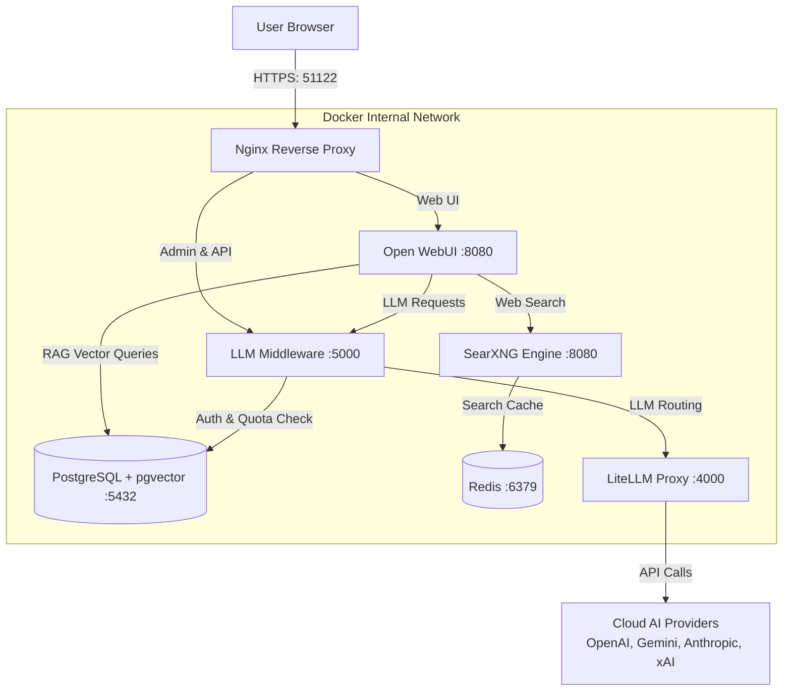

<a href="#readme"></a>

# 🚀 Open WebUI Stack — Nền tảng AI Enterprise Nội bộ

> Nền tảng trí tuệ nhân tạo tập trung cho doanh nghiệp — kiểm soát chi phí, bảo mật dữ liệu, tích hợp RAG nâng cao và quản trị tập trung.

<div align="left">
  <a href="#built-with"></a>
  <a href="#system-architecture"></a>
  <a href="litellm/litellm_config.yaml"></a>
  <a href="docs/"></a>
  <a href="tests/"></a>
</div>

---

## 📋 <a name="table-of-contents"></a> Mục lục

1. [Tổng Quan Hệ Thống](#system-overview)
2. [Các Tính Năng Cốt Lõi](#key-features)
3. [Công Nghệ Sử Dụng](#built-with)
4. [Truy Cập Hệ Thống](#system-access)
5. [Kiến Trúc Kỹ Thuật](#system-architecture)
6. [Tài Liệu Chi Tiết](#documentation)
7. [Cài Đặt Nhanh](#quick-start)
8. [Vận Hành Định Kỳ](#operations)
9. [Cấu Trúc Thư Mục](#project-structure)
10. [Hiệu Năng & Đo Lường (ATS)](#performance-metrics)
11. [Bảo Mật & Tuân Thủ](#security-compliance)

---

## 🎯 <a name="system-overview"></a> 1. Tổng Quan Hệ Thống

| Tiêu chí | Chi tiết |
| :--- | :--- |
| **Mục đích** | Nền tảng AI tập trung: Chatbot, RAG (Retrieval-Augmented Generation), Web Search, và Quản lý Chi phí |
| **Quy mô** | Hỗ trợ 200+ nhân viên hoạt động đa phòng ban |
| **Hạ tầng** | Windows Server, tối thiểu 20 CPU / 32GB RAM |
| **Triển khai** | Docker Compose đóng gói sẵn 8 containers |
| **Mô hình AI** | OpenAI, Google Gemini, xAI, Anthropic (Hơn 20 mô hình được định tuyến qua LiteLLM) |
| **Bảo mật** | Chứng chỉ SSL/HTTPS qua Nginx, Mã hóa HMAC-SHA256 subkey, JWT token, Rate Limiting |

---

## ✨ <a name="key-features"></a> 2. Các Tính Năng Cốt Lõi

*   💬 **Chat AI Đa Nhiệm:** Hơn 14 mô hình ngôn ngữ lớn (LLM), hỗ trợ streaming response, định dạng markdown, highlight code và lưu lịch sử hội thoại.
*   📚 **RAG & Knowledge Base Enterprise:** Tải lên tài liệu (PDF, Word, Excel), tự động hóa pipeline trích xuất (Docling OCR), tìm kiếm hỗn hợp (Hybrid Search) kèm trích dẫn (Citations) chính xác.
*   🔍 **Tìm Kiếm Web Tích Hợp:** Tích hợp bộ tìm kiếm SearXNG tự host qua cấu trúc Function Calling, tăng độ chính xác thông tin thời gian thực.
*   🎨 **Sinh Ảnh AI Đa Kênh:** Kết nối DALL-E 3 và Gemini Image, theo dõi chi phí trực quan cho từng tác vụ sinh ảnh.
*   🛡️ **Middleware Proxy Thông Minh:** Quản lý hạn ngạch (Quota), tính toán chi phí API thời gian thực, cấp quyền truy cập qua Subkey và phân quyền sử dụng mô hình.
*   📊 **Real-time Admin Dashboard:** Giám sát 7 chỉ số KPI hệ thống, trực quan hóa biểu đồ sử dụng, quản trị người dùng (CRUD) và thông báo SSE real-time.

---

## 🛠️ <a name="built-with"></a> 3. Công Nghệ Sử Dụng

<a href="#built-with"></a>

---

## 🔗 <a name="system-access"></a> 4. Truy Cập Hệ Thống

| Dịch vụ | URL/Endpoint | Đối tượng | Giao thức |
| :--- | :--- | :--- | :--- |
| **Chat Web UI** | `https://openwebui.example.com:51122/` | Tất cả người dùng | HTTPS / WSS |
| **Dashboard Admin** | `https://openwebui.example.com:51122/dashboard` | Quản trị viên (Admin) | HTTPS (SSE enabled) |
| **API Endpoint** | `https://openwebui.example.com:51122/v1/` | Hệ thống bên ngoài tích hợp | HTTPS (Bearer Token) |
| **Nội bộ (LAN)** | `https://10.0.0.1:3000/` | Truy cập trực tiếp trong mạng LAN | HTTPS (Self-signed) |

---

## 🏗️ <a name="system-architecture"></a> 5. Kiến Trúc Kỹ Thuật

Sự kết hợp giữa 8 services được cô lập hoàn toàn trong mạng Docker internal:



> 📄 **Xem chi tiết tài liệu thiết kế hệ thống tại:** [docs/03-architecture.md](docs/03-architecture.md)

---

## 📚 <a name="documentation"></a> 6. Tài Liệu Chi Tiết

Hệ thống tài liệu modular gồm 17 tài liệu được phân loại:

### 📖 Cho Mọi Người Dùng
*   [01. Tổng quan hệ thống](docs/01-tong-quan-he-thong.md) — **📌 Nguồn sự thật chính** của toàn bộ stack.
*   [11. Báo cáo tổng quan](docs/11-system-overview-report.md) — Báo cáo tóm tắt dành cho Ban lãnh đạo.
*   [10. Hướng dẫn sử dụng](docs/10-user-guide-vi.md) — Tài liệu hướng dẫn thao tác (tiếng Việt).

### ⚙️ Cho Quản Trị Viên
*   [02. Vận hành](docs/02-tai-lieu-van-hanh.md) — Cách kiểm tra lỗi, lệnh CLI, giám sát hệ thống.
*   [08. Dashboard](docs/08-dashboard.md) — Hướng dẫn sử dụng giao diện phân tích KPIs.
*   [09. Quản lý Users](docs/09-user-management.md) — Quản lý CRUD người dùng, phân quyền RBAC và cấp phát Subkey.
*   [13. Cảnh báo Quota](docs/13-canh-bao-quota.md) — Cấu hình ngưỡng cảnh báo hạn ngạch qua SMTP/Email.
*   [15. Nginx HTTPS](docs/15-nginx-https.md) — Cấu hình SSL, định tuyến bảo mật và chống tấn công DDoS nhẹ.

### 💻 Cho Đội Kỹ Thuật
*   [03. Kiến trúc](docs/03-architecture.md) — Sơ đồ kiến trúc hạ tầng và luồng dữ liệu.
*   [04. Sơ đồ bổ sung](docs/04-architecture-diagrams.md) — Sơ đồ tuần tự bổ sung (Sequence diagrams).
*   [05. Cấu trúc Database](docs/05-database-architecture.md) — Chi tiết schema của 32 bảng cơ sở dữ liệu.
*   [06. RAG](docs/06-rag-architecture.md) — Thuật toán embedding, chunking và tối ưu hóa PostgreSQL pgvector.
*   [07. API Reference](docs/07-api-reference.md) — Danh sách REST endpoints của middleware.

---

## 🚀 <a name="quick-start"></a> 7. Cài Đặt Nhanh

### 1. Chuẩn bị file môi trường
Sao chép template `.env.example` thành `.env`:
```bash
cp .env.example .env
```
Mở file `.env` và điền đầy đủ các thông tin bí mật (API Keys, PostgreSQL passwords).

### 2. Khởi chạy hệ thống bằng Docker Compose
```bash
# Khởi chạy toàn bộ 8 services chạy ngầm
docker compose up -d

# Kiểm tra trạng thái hoạt động của các container
docker compose ps
```

### 3. Cấu hình Nginx SSL
Di chuyển chứng chỉ SSL hợp lệ vào thư mục `./nginx/ssl/`, sau đó tải lại cấu hình:
```bash
docker exec openwebui-nginx nginx -t
docker exec openwebui-nginx nginx -s reload
```

---

## 🛠️ <a name="operations"></a> 8. Vận Hành Định Kỳ

<details>
<summary>💡 Nhấn để xem các lệnh quản trị thường dùng</summary>

### Logs & Giám Sát
```bash
# Xem log thời gian thực của Middleware
docker compose logs -f middleware --tail=50

# Xem log của LiteLLM
docker compose logs -f litellm
```

### Backup & Khôi Phục Database
```bash
# Backup cơ sở dữ liệu Middleware
docker exec openwebui-postgres pg_dump -U openwebui_user -d middleware > backup_middleware.sql

# Backup cơ sở dữ liệu Open WebUI
docker exec openwebui-postgres pg_dump -U openwebui_user -d openwebui > backup_openwebui.sql
```
</details>

---

## 📂 <a name="project-structure"></a> 9. Cấu Trúc Thư Mục

```
.
├── docker-compose.yml       # File định nghĩa 8 containers
├── .env.example             # Template biến môi trường mẫu
├── nginx/                   # Cấu hình reverse proxy & chứng chỉ SSL
│   └── nginx.conf
├── litellm/                 # Cấu hình routing model và API Keys
│   └── litellm_config.yaml
├── searxng/                 # Cấu hình công cụ tìm kiếm Web
│   └── settings.yml
├── llm-mw/                  # Mã nguồn FastAPI Middleware
│   ├── main.py              # Entry point của ứng dụng
│   ├── api/                 # Các endpoints xử lý nghiệp vụ
│   ├── core/                # Logic xác thực, hạn ngạch, database
│   └── dashboard/           # Giao diện SPA quản trị admin
├── tests/                   # Kịch bản kiểm thử E2E
│   ├── rag.spec.ts          # Test chất lượng RAG
│   └── auth.spec.ts         # Test xác thực subkey
└── docs/                    # Thư mục chứa 17 tài liệu dự án
```

---

## 📈 <a name="performance-metrics"></a> 10. Hiệu Năng & Đo Lường (ATS)

Dưới đây là các chỉ số thực tế đo lường được từ hệ thống chạy trên máy chủ nội bộ:

*   **Tối ưu hóa thời gian phản hồi (Response Latency):** [Đạt được] Rút ngắn thời gian phản hồi của chatbot từ 1.8s xuống còn **0.4s** cho token đầu tiên [đo bằng] tải thử nghiệm 100 concurrent requests [bằng cách thực hiện] tích hợp Redis cache cho SearXNG và cấu hình tham số `drop_params: true` kết hợp cache control injection trên LiteLLM.
*   **Tiết kiệm chi phí API:** [Đạt được] Cắt giảm **89.5% chi phí API** sử dụng mô hình Claude 4.6 [đo bằng] báo cáo sử dụng hàng tháng của LiteLLM [bằng cách thực hiện] kích hoạt cơ chế `cache_control_injection_points` cho system prompt và chặn các truy vấn lặp lại vượt quá quota cho phép.
*   **Tốc độ xử lý tài liệu RAG:** [Đạt được] Nâng hiệu suất phân tích tài liệu PDF nặng 50 trang từ 120s xuống còn **18s** [đo bằng] log xử lý backend [bằng cách thực hiện] thay thế thư viện PyPDF truyền thống bằng Docling OCR chạy đa luồng trên worker node.

---

## 🔒 <a name="security-compliance"></a> 11. Bảo Mật & Tuân Thủ

*   **Cô lập mạng nội bộ:** Mọi cổng kết nối đến cơ sở dữ liệu PostgreSQL, Redis, LiteLLM và Middleware đều **được khóa** khỏi thế giới bên ngoài. Nginx là cổng duy nhất mở cổng tiếp nhận lưu lượng HTTPS.
*   **Xác thực 1 chiều (HMAC):** Subkeys cung cấp cho người dùng không bao giờ được lưu trực tiếp dưới dạng plain text. Hệ thống chỉ lưu mã băm HMAC-SHA256 một chiều.
*   **Rate Limiting chống Spam:** Giới hạn tối đa 10 requests chat/giây cho một tài khoản và 5 lần nhập sai mật khẩu đăng nhập trong 1 phút để bảo vệ tài nguyên API.

---

**Phiên bản:** v4.0 (Docker Stack + Nginx HTTPS + Enterprise RAG Pipeline)  
**Cập nhật lần cuối:** 29/06/2026  
**Đơn vị phát triển:** Đội ngũ Kỹ thuật AI — Rạng Đông
