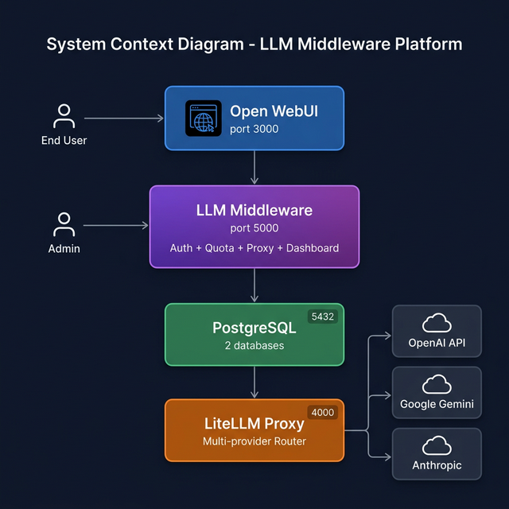
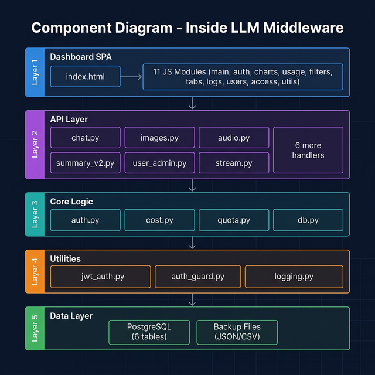
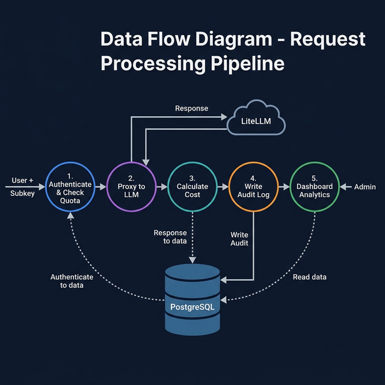
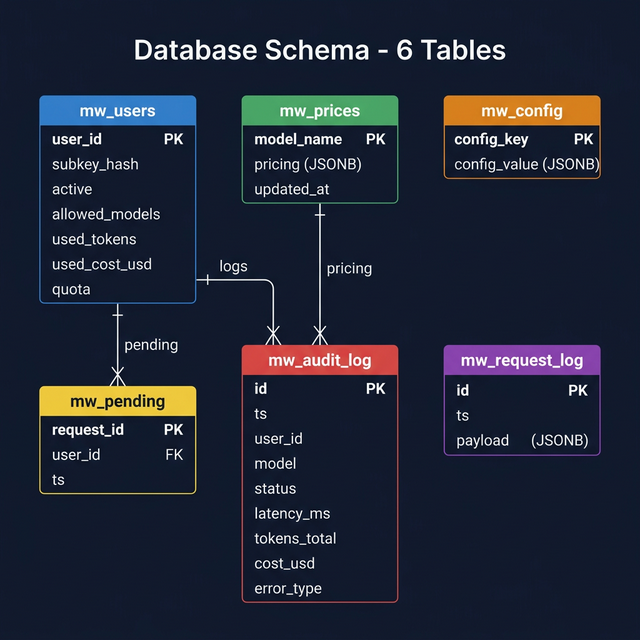
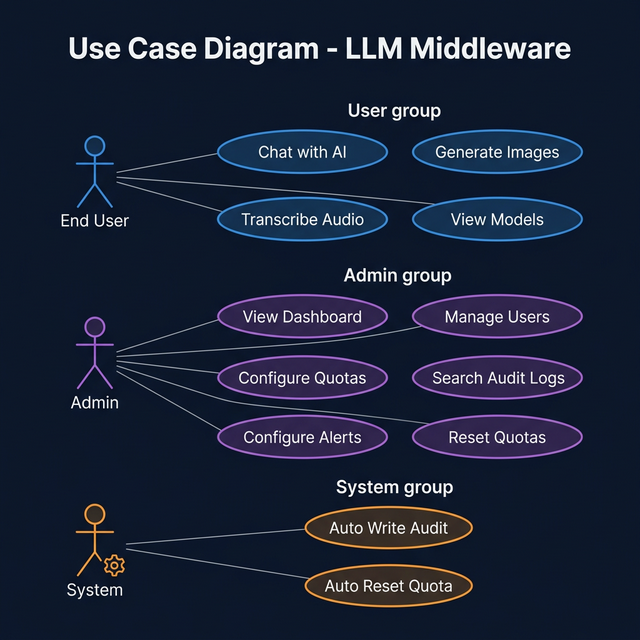
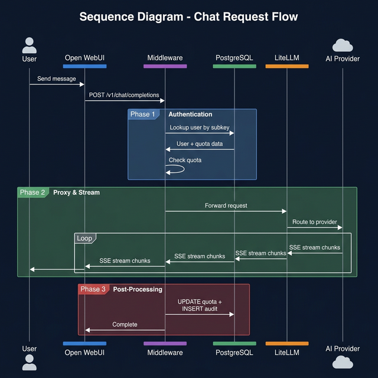
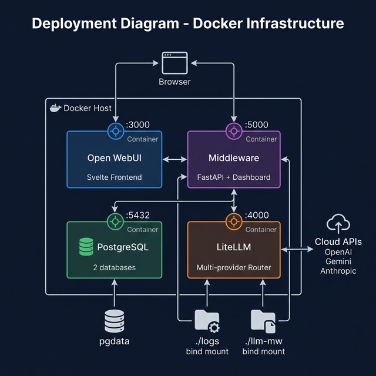

# ARCHITECTURE DIAGRAMS — LLM Middleware

> 7 biểu đồ kiến trúc hệ thống, được vẽ chuyên nghiệp dưới dạng hình ảnh.
> File ảnh nằm trong thư mục `docs/diagrams/`

---

## 1. System Context Diagram

> **Câu hỏi:** Hệ thống Middleware nằm ở đâu trong tổng thể? Tương tác với những thành phần nào?



**Giải thích:**
| STT | Thành phần     | Port | Vai trò                                                |
| --- | -------------- | ---- | ------------------------------------------------------ |
| 01  | Nginx          | 3000 | Reverse proxy HTTPS — cửa duy nhất ra ngoài            |
| 02  | Open WebUI     | 8080 | Giao diện chat cho end user (qua Nginx)                |
| 03  | LLM Middleware | 5000 | Trung tâm: Auth → Quota → Proxy → Audit → Dashboard    |
| 04  | LiteLLM Proxy  | 4000 | Router multi-provider (OpenAI, Gemini, xAI, Anthropic) |
| 05  | PostgreSQL     | 5432 | Lưu trữ dữ liệu (2 DB: `openwebui` + `middleware`)     |
| 06  | Docling        | 5001 | OCR/Document extraction (PDF, DOCX, scan)              |
| 07  | SearXNG        | 8080 | Metasearch engine (DDG, Brave, Bing)                   |
| 08  | Redis          | 6379 | Search result cache cho SearXNG                        |

---

## 2. Component Diagram

> **Câu hỏi:** Bên trong Middleware có những module nào? Quan hệ giữa chúng ra sao?



**5 layers:**
| STT | Layer         | Files                                        | Vai trò                                              |
| --- | ------------- | -------------------------------------------- | ---------------------------------------------------- |
| 01  | Dashboard SPA | `index.html` + 11 JS modules                 | UI chạy trên browser, gọi API qua `fetch()`          |
| 02  | API Layer     | 12 route handlers (FastAPI)                  | Nhận HTTP request, gọi core logic, trả JSON          |
| 03  | Core Logic    | `auth.py`, `cost.py`, `quota.py`, `db.py`    | Business logic: xác thực, tính cost, kiểm tra quota  |
| 04  | Utilities     | `jwt_auth.py`, `auth_guard.py`, `logging.py` | Hỗ trợ: JWT tokens, route protection, dual-write log |
| 05  | Data Layer    | PostgreSQL + backup files                    | Lưu trữ primary (DB) + secondary (JSON/CSV)          |

---

## 3. Data Flow Diagram (DFD)

> **Câu hỏi:** Dữ liệu chảy qua hệ thống như thế nào? Xử lý ở đâu? Lưu vào đâu?



**5 process chính:**
| #   | Process                    | Input             | Output                          |
| --- | -------------------------- | ----------------- | ------------------------------- |
| 1   | Authenticate & Check Quota | Request + Subkey  | user_id, allowed_models         |
| 2   | Proxy to LLM               | Validated request | AI response (stream/non-stream) |
| 3   | Calculate Cost             | Response + usage  | cost_usd, tokens_total          |
| 4   | Write Audit Log            | Audit data        | INSERT vào `mw_audit_log`       |
| 5   | Dashboard Analytics        | Admin query       | Charts, tables, insights        |

---

## 4. Entity Relationship Diagram (ERD)

> **Câu hỏi:** Database có bao nhiêu bảng? Schema như thế nào? Quan hệ giữa các bảng?



**6 bảng PostgreSQL:**
| STT | Bảng             | PK            | Rows ước tính | Chức năng                                  |
| --- | ---------------- | ------------- | ------------- | ------------------------------------------ |
| 01  | `mw_users`       | `user_id`     | ~10           | User accounts, subkeys, quotas             |
| 02  | `mw_prices`      | `model_name`  | ~20           | Model pricing (input/output per token)     |
| 03  | `mw_config`      | `config_key`  | ~5            | Alert config, system settings              |
| 04  | `mw_pending`     | `request_id`  | 0-10          | Requests đang xử lý (tạm thời)             |
| 05  | `mw_audit_log`   | `id` (serial) | 1000+/month   | **Bảng lớn nhất** — mỗi AI request = 1 row |
| 06  | `mw_request_log` | `id` (serial) | 5000+/month   | HTTP request/response detail logs          |

**Quan hệ:**
- `mw_users.user_id` → `mw_audit_log.user_id` (1:N — mỗi user có nhiều audit logs)
- `mw_users.user_id` → `mw_pending.user_id` (1:N — mỗi user có nhiều pending requests)
- `mw_prices.model_name` → `mw_audit_log.model` (1:N — mỗi model có nhiều audit logs)

---

## 5. Use Case Diagram

> **Câu hỏi:** Ai (actor) làm gì trong hệ thống? Có bao nhiêu chức năng?



**3 Actors × 12 Use Cases:**

| STT | Actor        | Use Cases                                                                                         | Endpoints                                                                                                                              |
| --- | ------------ | ------------------------------------------------------------------------------------------------- | -------------------------------------------------------------------------------------------------------------------------------------- |
| 01  | **End User** | Chat with AI, Generate Images, Transcribe Audio, View Models                                      | `POST /v1/chat/completions`, `POST /v1/images/generations`, `POST /v1/audio/transcriptions`, `GET /v1/models`                          |
| 02  | **Admin**    | View Dashboard, Manage Users, Configure Quotas, Search Audit Logs, Configure Alerts, Reset Quotas | `/v1/_mw/summary`, `/v1/_mw/admin/users`, `/v1/_mw/quota-status`, `/v1/_mw/audit/query`, `/v1/_mw/admin/alerts/config`, `/admin/reset` |
| 03  | **System**   | Auto Write Audit, Auto Reset Quota                                                                | Middleware middleware (mỗi request tự ghi), `quota.py` (auto-reset khi hết period)                                                     |

---

## 6. Sequence Diagram — Chat Request Flow

> **Câu hỏi:** Khi user gửi 1 tin nhắn, luồng xử lý chi tiết từng bước như thế nào?



**3 phase:**

| STT | Phase                  | Duration | Operations                                         |
| --- | ---------------------- | -------- | -------------------------------------------------- |
| 01  | 🔵 **Authentication**  | ~10ms    | Hash subkey → DB lookup → quota check              |
| 02  | 🟢 **Proxy & Stream**  | 1-30s    | Forward to LiteLLM → SSE chunks → realtime display |
| 03  | 🔴 **Post-Processing** | ~10ms    | DELETE pending → UPDATE quota → INSERT audit       |

**Timeline chi tiết:**
```
User → Open WebUI → Middleware:  POST /v1/chat/completions
  ├── [10ms]  Hash subkey → SELECT mw_users → check quota
  ├── [5ms]   INSERT mw_pending
  ├── [50-200ms] Forward to LiteLLM → first token
  ├── [1-30s]  Stream SSE chunks → User sees text realtime
  ├── [5ms]   DELETE mw_pending  
  ├── [5ms]   UPDATE mw_users (quota)
  └── [5ms]   INSERT mw_audit_log
```

---

## 7. Deployment Diagram

> **Câu hỏi:** Docker infrastructure trông như thế nào? Ports, volumes, network?



**Containers & Ports:**
| STT | Container              | Port | Exposed     | Image                                            |
| --- | ---------------------- | ---- | ----------- | ------------------------------------------------ |
| 01  | `openwebui-nginx`      | 3000 | ✅ External | `nginx:alpine`                                   |
| 02  | `openwebui-postgres`   | 5432 | ❌ Internal | `pgvector/pgvector:0.8.0-pg16`                   |
| 03  | `openwebui-litellm`    | 4000 | ❌ Internal | Custom build                                     |
| 04  | `openwebui-middleware` | 5000 | ✅ External | Custom build (Python 3.11 + FastAPI)             |
| 05  | `open-webui`           | 8080 | ❌ Internal | `ghcr.io/open-webui`                             |
| 06  | `openwebui-docling`    | 5001 | ❌ Internal | `quay.io/docling-project/docling-serve-cpu`      |
| 07  | `openwebui-searxng`    | 8080 | ❌ Internal | `searxng/searxng:latest`                         |
| 08  | `openwebui-redis`      | 6379 | ❌ Internal | `redis:7-alpine`                                 |

**Volumes:**
| STT | Volume       | Type       | Container  | Size ước tính     |
| --- | ------------ | ---------- | ---------- | ----------------- |
| 01  | `pgdata`     | Named      | PostgreSQL | 100MB-1GB         |
| 02  | `open-webui` | Named      | Open WebUI | ~50MB             |
| 03  | `./logs`     | Bind mount | Middleware | ~100MB (rotation) |
| 04  | `./llm-mw`   | Bind mount | Middleware | ~5MB (source)     |

**Startup order:** PostgreSQL → Redis → LiteLLM → Middleware → Docling → SearXNG → OpenWebUI → Nginx

---

**Last Updated:** April 9, 2026 | **Version:** 4.0 (9 containers, Docling migration)
