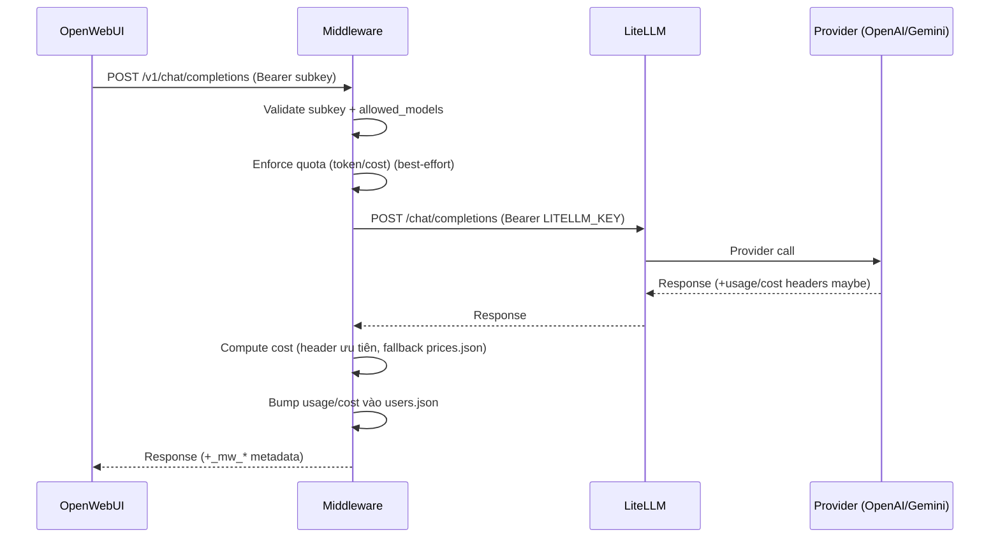

# BÁO CÁO HIỆN TRẠNG HỆ THỐNG LLM GATEWAY (OpenWebUI → Middleware → LiteLLM)

Ngày lập: 2025-12-16  
Phạm vi: báo cáo hiện trạng, kiến trúc, công nghệ, tính năng, điểm khó, bài toán kinh tế và các bước vận hành của hệ thống trong repo này.

---

## 1) Tóm tắt điều hành (Executive Summary)
Hệ thống hiện tại là một **stack 3 tầng chạy native trên Windows** nhằm cung cấp trải nghiệm chat (và đa phương thức) theo chuẩn **OpenAI-compatible API**, đồng thời bổ sung lớp **xác thực (subkey), hạn mức (quota) và theo dõi chi phí** trước khi gọi lên các nhà cung cấp mô hình.

**Chuỗi chính:**
- **OpenWebUI (UI, cổng 3000)**: giao diện chat và quản lý hội thoại.
- **Middleware (FastAPI, cổng 5000)**: xác thực subkey, kiểm soát quota/cost, logging, proxy các endpoint đa phương thức.
- **LiteLLM Proxy (cổng 4000)**: lớp proxy hợp nhất, định tuyến request theo model tới **OpenAI** và **Google Gemini** (và các model video phụ thuộc quyền truy cập tài khoản).

Hệ thống đã triển khai và vận hành được các nhóm tác vụ:
- Chat completions (streaming & non-streaming)
- Models listing
- Image generation
- TTS (speech)
- STT (transcriptions)
- Video generation (có phụ thuộc quyền tài khoản model)

Mục tiêu của báo cáo: giúp **cố vấn hiểu rõ kiến trúc hiện trạng**, nhận diện điểm mạnh/yếu, rủi ro vận hành, và đề xuất hướng phát triển.

---

## 2) Bài toán / Nhu cầu nghiệp vụ
### 2.1 Bài toán
Khi triển khai LLM cho nội bộ/khách hàng, các vấn đề thường gặp:
- Không kiểm soát được **ai dùng**, **dùng model nào**, và **tốn bao nhiêu tiền**.
- UI/ứng dụng gọi thẳng lên provider làm khó áp dụng quota, audit, và thay đổi nhà cung cấp.
- Đa phương thức (ảnh/giọng nói/video) có cách tính phí và giới hạn rất khác so với chat.

### 2.2 Mục tiêu hệ thống
- Cung cấp **một cổng OpenAI-compatible** cho nhiều mô hình/provider.
- Quản lý người dùng bằng **subkey** (đơn giản cho tích hợp).
- Áp dụng quota/cost theo:
  - Token/cost tổng
  - Theo loại tác vụ (image/TTS/STT/video)
- Đảm bảo nguyên tắc: **“chỉ ghi nhận/charge sau khi upstream thành công”** (best-effort theo thiết kế hiện tại).

---

## 3) Hiện trạng triển khai (As-is)
### 3.1 Môi trường
- OS: Windows
- Runtime: Python 3.11+ (khuyến nghị dùng venv tại `D:\Works\.venv`)
- Phương thức chạy: PowerShell scripts + uvicorn

### 3.2 Các dịch vụ & cổng
| Thành phần | Vai trò | Cổng | Host bind | Ghi chú |
|---|---:|---:|---|---|
| OpenWebUI | UI chat | 3000 | cấu hình được | có thể bind `0.0.0.0` để truy cập LAN |
| Middleware (FastAPI) | Auth/Quota/Logging/Proxy | 5000 | `0.0.0.0` | nhận request từ OpenWebUI |
| LiteLLM Proxy | Router/proxy tới provider | 4000 | `0.0.0.0` | master_key bảo vệ endpoint `/v1/*` |

### 3.3 Trạng thái tính năng chính (tổng hợp từ code)
- Middleware có endpoint:
  - `GET /health`
  - `GET /v1/models`
  - `POST /v1/chat/completions` (stream & non-stream)
  - `POST /v1/images/generations`
  - `POST /v1/audio/speech` (stream bytes)
  - `POST /v1/audio/transcriptions` (multipart)
  - `POST /v1/video/generations`
  - `GET /admin/usage`, `POST /admin/reset`, `POST /admin/reconcile`
- LiteLLM cấu hình model ở `litellm/litellm_config.yaml` gồm:
  - OpenAI: `gpt-5*`, `gpt-4o*`, `gpt-4.1*`, `gpt-image-1`, `gpt-4o-mini-tts`, `gpt-4o(-mini)-transcribe`, `sora-2*`
  - Gemini: `gemini-2.5-pro`, `gemini-2.5-flash`, `gemini-2.5-flash-lite`, `gemini-2.5-flash-image`,…

---

## 4) Kiến trúc hệ thống (Architecture)
### 4.1 Sơ đồ tổng quan
```mermaid
flowchart LR
  U[Người dùng / Trình duyệt] -->|HTTP| W[OpenWebUI :3000]
  W -->|OpenAI-compatible API\nAuthorization: Bearer <subkey>| M[Middleware (FastAPI) :5000]
  M -->|OpenAI-compatible API\nAuthorization: Bearer <LITELLM_KEY>| L[LiteLLM Proxy :4000]
  L --> O[OpenAI APIs]
  L --> G[Google Gemini APIs]
  L --> V[Video Provider (OpenAI/Sora)*]

  subgraph Storage
    WDB[(openwebui_data/webui.db)]
    MJSON[(llm-mw/users.json)]
    MLOG[(logs/middleware.log)]
    LLOG[(litellm/litellm.log)]
  end

  W --- WDB
  M --- MJSON
  M --- MLOG
  L --- LLOG
```
\* Khả năng video phụ thuộc quyền tài khoản/provider.

### 4.2 Luồng request điển hình (Chat)


### 4.3 Vị trí “chốt kiểm soát” (Control Points)
- **Auth**: nằm ở Middleware (`_require_user`), dùng subkey.
- **Model governance**: Middleware check `allowed_models`.
- **Quota & cost**:
  - Token/cost tổng: enforce & bump tại chat non-stream.
  - Image/TTS/STT/Video: enforce “best-effort” theo request count/đơn vị (chars/seconds) + cost.
- **Audit/Observability**:
  - Middleware có log request latency theo `rid`.
  - LiteLLM log có thể dùng cho reconcile.

---

## 5) Cấu trúc công nghệ (Technology Stack)
### 5.1 Backend
- Python
- FastAPI + Uvicorn
- httpx (AsyncClient pooling)
- python-dotenv (load `.env`)

### 5.2 Proxy LLM
- LiteLLM proxy (OpenAI-compatible)

### 5.3 UI
- OpenWebUI (serve local)

### 5.4 Lưu trữ
- OpenWebUI: SQLite (`openwebui_data/webui.db`)
- Middleware: JSON file (`llm-mw/users.json`) + CSV pending (`llm-mw/pending.csv`) (local)

### 5.5 Logging
- Middleware: `logs/middleware.log` (RotatingFileHandler, UTF-8)
- LiteLLM: `litellm/litellm.log`
- Scripts redirect stdout/stderr vào `logs/*.stdout.log` và `logs/*.stderr.log`

---

## 6) Mô tả từng thành phần (Chi tiết)

### 6.1 OpenWebUI (UI)
**Vai trò:** UI chat, quản lý hội thoại, cấu hình kết nối OpenAI API base.

**Kết nối tới hệ thống:**
- API Base URL trỏ vào Middleware: `http://127.0.0.1:5000/v1`
- API Key là **subkey** của user.

**Dữ liệu:** lưu ở `openwebui_data/`.

**Điểm vận hành đáng chú ý:**
- Khi redirect output trên Windows, OpenWebUI có thể gặp lỗi Unicode banner → đã được script start ép UTF-8.
- Có thể bind host để mở LAN.

### 6.2 Middleware (FastAPI) – `llm-mw/main.py`
**Vai trò:**
- Cổng vào chính cho OpenWebUI.
- Xác thực subkey.
- Kiểm soát quyền model (allowlist).
- Áp dụng quota/cost.
- Proxy tới LiteLLM.

**Thiết kế chính (theo code):**
- Tạo `request_id` dạng `mw_<uuid>` và đưa vào:
  - `X-Request-ID` header khi gọi LiteLLM
  - `metadata.mw_request_id` trong body (một số endpoint)
- Log latency theo request (middleware-level) vào `logs/middleware.log`.
- Reuse pooled `httpx.AsyncClient` (startup/shutdown events) cho non-streaming.

**Streaming (điểm quan trọng):**
- Với chat streaming và TTS streaming, middleware **không dùng `async with client.stream(...)` rồi return ngay** (tránh đóng stream sớm). Thay vào đó mở stream, kiểm tra status, rồi yield bytes trong generator, cleanup ở `finally`.

**Quota/cost (hiện trạng):**
- `users.json` chứa cấu hình quota:
  - `limit_tokens`, `limit_cost_usd`
  - thêm limit theo task: `limit_image_requests`, `limit_tts_requests`, `limit_tts_chars`, `limit_stt_requests`, `limit_video_requests`, `limit_video_seconds` (nếu user cấu hình)
- Reset chu kỳ theo `weekly` hoặc `monthly` và timezone (mặc định có support `Asia/Bangkok`).
- Cost ưu tiên từ header của LiteLLM (`x-litellm-response-cost`), fallback qua `prices.json`.

**Admin endpoints:**
- `/admin/usage`: xem users/quota
- `/admin/reset`: reset quota
- `/admin/reconcile`: reconcile 1 request dựa trên LiteLLM log (phục hồi sau sự cố streaming/cancel)

### 6.3 LiteLLM Proxy – `litellm/litellm_config.yaml`
**Vai trò:**
- Cung cấp OpenAI-compatible API cho nhiều provider.
- `master_key` để middleware xác thực khi gọi.
- Dùng `model_list` để ánh xạ `model_name` → `litellm_params.model` (openai/…, gemini/…)

**Hiện trạng cấu hình:**
- Bind `0.0.0.0:4000`
- `enable_spend_logging: false` (middleware tự tính/ghi nhận cost theo header/fallback)
- Log ra file `litellm/litellm.log`

### 6.4 Scripts vận hành – `scripts/*.ps1`
- `scripts/start_stack.ps1`: start 3 service nếu chưa listen; redirect log; hỗ trợ `-OpenWebUIHost`.
- `scripts/stop_stack.ps1`: stop theo port.
- `scripts/run_litellm_with_env.ps1`: load env và ép UTF-8 để tránh crash khi redirect output.

---

## 7) Tính năng (Feature Inventory)
### 7.1 API compatibility
- Middleware expose các endpoint theo chuẩn OpenAI tương thích OpenWebUI.

### 7.2 Quota và chi phí
- Token quota và cost quota.
- Quota theo loại tác vụ (image/TTS/STT/video).
- Nguyên tắc: enforce quota trước call (apply=False), chỉ bump usage sau khi upstream thành công.

### 7.3 Logging & truy vết
- Request log có `rid` + latency ms.
- Stream lifecycle log (`stream_start`, `stream_end`, `stream_error`).

### 7.4 Model governance
- Allowlist theo user.
- Middleware “dịch” một số tham số để tương thích model đặc thù (ví dụ gpt-5).

---

## 8) Điểm khó / rủi ro kỹ thuật (Pain Points)
### 8.1 Streaming trên Windows + proxy layers
- Sai cách quản lý context manager có thể làm **đóng upstream stream sớm** → UI treo/stop.
- Hiện đã xử lý bằng cách giữ `resp` mở đến khi generator kết thúc.

### 8.2 Tương thích tham số giữa provider
- Một số model/provider không chấp nhận `user`, `metadata`, hoặc field OpenAI-style.
- Middleware hiện có logic drop param theo model (ví dụ gemini image).

### 8.3 gpt-5 và “token budget”
- gpt-5 có xu hướng “reasoning-first”; nếu output token budget quá thấp có thể trả về nội dung hiển thị rỗng → OpenWebUI trông như bị dừng.
- Middleware đặt “safe floor” cho `max_completion_tokens`.

### 8.4 Tính phí đa phương thức
- Image/TTS/STT/video có pricing không đồng nhất.
- Header cost từ LiteLLM là tốt nhất; fallback `prices.json` chỉ là ước lượng.

### 8.5 Lưu state quota bằng file
- `users.json` dễ xung đột khi nhiều instance/worker.
- Lock hiện tại là `threading.Lock` (trong-process), không bảo vệ multi-process.

### 8.6 Security baseline
- CORS đang `allow_origins=['*']` (phù hợp dev, rủi ro prod).
- Chưa có TLS/Reverse proxy/WAF.
- Keys đi qua header Bearer: cần bảo vệ mạng nội bộ.

---

## 9) Bài toán kinh tế (Economics)
### 9.1 Các “cost driver” chính
- Chat/text: token in/out theo model.
- Image generation: cost theo số ảnh và (tuỳ model) chất lượng/size.
- TTS: cost theo số ký tự (fallback) và/hoặc cost header.
- STT: khó ước lượng nếu không có cost header (minutes/audio length); hiện ưu tiên cost header.
- Video: cost theo giây (seconds) và có thể theo độ phân giải.

### 9.2 Cơ chế kiểm soát chi phí hiện có
- Subkey per-user + quota theo chu kỳ (weekly/monthly).
- Có thể áp dụng thêm quota theo tác vụ để tránh “đột biến chi phí” (đặc biệt image/video).
- Log + request id để audit/reconcile.

### 9.3 Hạn chế kinh tế hiện tại
- Fallback pricing (`prices.json`) có thể lệch so với thực tế từng provider/account.
- Nếu streaming bị client abort, cost thực tế có thể đã phát sinh nhưng chưa ghi nhận → cần reconcile.

---

## 10) Quy trình vận hành (Runbook)
### 10.1 Khởi động stack
- Chạy bằng script: `scripts/start_stack.ps1`
- Có thể bind LAN cho UI: `-OpenWebUIHost 0.0.0.0`
- Log xem tại thư mục `logs/`.

### 10.2 Dừng stack
- `scripts/stop_stack.ps1` (stop theo port)

### 10.3 Smoke test
- Script: `llm-mw/smoke_test_endpoints.py`
- Yêu cầu env:
  - `MW_SUBKEY`: subkey user
  - (optional) `MW_BASE_URL` (mặc định `http://127.0.0.1:5000`)

---

## 11) Hiện trạng “đang làm ra” (Deliverables đã có)
- Stack 3 tầng chạy local Windows.
- Proxy endpoint đa phương thức đầy đủ ở Middleware.
- Quota/cost tracking theo user.
- Scripts start/stop để vận hành.
- Logging để phân tích latency và sự cố streaming.

---

## 12) Gợi ý câu hỏi cho cố vấn (để xin ý kiến phát triển)
1) Mục tiêu sản phẩm: nội bộ hay thương mại? số lượng user đồng thời dự kiến?
2) Cần multi-tenant / phân quyền theo phòng ban/project không?
3) Có cần lưu usage/billing vào DB (Postgres/MySQL) thay vì JSON không?
4) Yêu cầu bảo mật: TLS, SSO, audit trail, retention log?
5) Định hướng đa phương thức: image/video có ưu tiên hay chỉ PoC?
6) Yêu cầu quan sát hệ thống: metrics (Prometheus), tracing (OpenTelemetry)?
7) Chiến lược model: giữ ít model “mạnh nhất” vs linh hoạt nhiều model?

---

## 13) Phụ lục: Map file quan trọng
- `README.md`: hướng dẫn setup & kiến trúc (mô tả tổng quan)
- `litellm/litellm_config.yaml`: danh sách model + master_key
- `llm-mw/main.py`: logic auth/quota/cost/streaming/proxy
- `llm-mw/prices.json`: bảng giá fallback
- `scripts/start_stack.ps1`, `scripts/stop_stack.ps1`, `scripts/run_litellm_with_env.ps1`: vận hành

---

## 14) Ghi chú về “hình ảnh” kiến trúc
Trong báo cáo này mình đã tạo sơ đồ Mermaid (flowchart + sequence). Nếu bạn có “hình ảnh gốc” muốn mình **vẽ lại đúng bố cục/màu sắc** (diagram chuẩn để đưa vào slide), bạn gửi/đính kèm hình đó hoặc mô tả (các khối + nhãn + mũi tên). Mình sẽ dựng lại phiên bản:
- Mermaid nâng cấp (dễ maintain trong repo), hoặc
- Xuất dạng SVG/PNG (nếu bạn có công cụ render), hoặc
- Sơ đồ “draw.io style” (mình có thể đưa file XML nếu bạn muốn).
