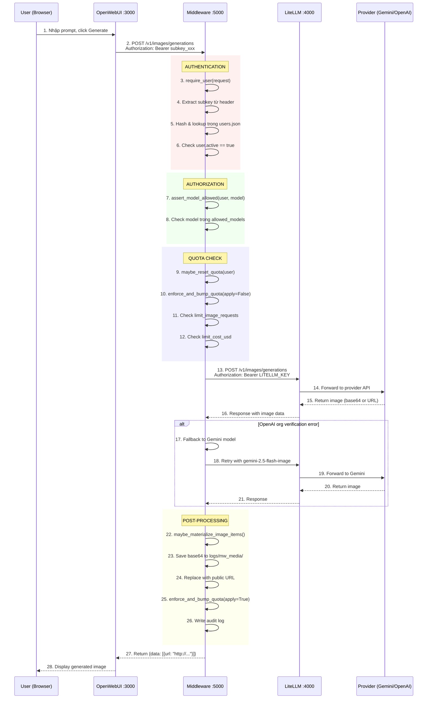

# 🎨 LUỒNG TẠO ẢNH (IMAGE GENERATION) - PHÂN TÍCH CHI TIẾT

> **Phiên bản:** 1.0  
> **Ngày tạo:** 05/02/2026  
> **Mục đích:** Giải thích chi tiết cơ chế, code, luồng, endpoint khi user tạo ảnh trong hệ thống

---

## 📋 MỤC LỤC

1. [Tổng Quan Luồng](#1-tổng-quan-luồng)
2. [Sơ Đồ Sequence Chi Tiết](#2-sơ-đồ-sequence-chi-tiết)
3. [Chi Tiết Từng Bước](#3-chi-tiết-từng-bước)
4. [Phân Tích Code](#4-phân-tích-code)
5. [API Request/Response Format](#5-api-requestresponse-format)
6. [Cấu Hình & Models](#6-cấu-hình--models)
7. [Debugging & Troubleshooting](#7-debugging--troubleshooting)

---

## 1. Tổng Quan Luồng

### 1.1 Kiến Trúc Tổng Thể

```
┌─────────────────┐       ┌─────────────────┐       ┌─────────────────┐       ┌─────────────────┐
│   OpenWebUI     │──────▶│   Middleware    │──────▶│    LiteLLM      │──────▶│  Provider API   │
│   (Port 3000)   │       │   (Port 5000)   │       │   (Port 4000)   │       │ (Gemini/OpenAI) │
└─────────────────┘       └─────────────────┘       └─────────────────┘       └─────────────────┘
       │                         │                         │                         │
       │ 1. User gõ prompt       │                         │                         │
       │ 2. Chọn model           │                         │                         │
       │ 3. Click "Generate"     │                         │                         │
       │                         │                         │                         │
       │─────────────────────────▶                         │                         │
       │ POST /v1/images/generations                       │                         │
       │ Authorization: Bearer <subkey>                    │                         │
       │                         │                         │                         │
       │                         │ 4. Validate subkey      │                         │
       │                         │ 5. Check quota          │                         │
       │                         │ 6. Forward request      │                         │
       │                         │─────────────────────────▶                         │
       │                         │ POST /v1/images/generations                       │
       │                         │ Authorization: Bearer <LITELLM_KEY>               │
       │                         │                         │                         │
       │                         │                         │ 7. Route to provider    │
       │                         │                         │─────────────────────────▶
       │                         │                         │ POST /images/generations│
       │                         │                         │                         │
       │                         │                         │◀─────────────────────────
       │                         │                         │ 8. Return image data    │
       │                         │◀─────────────────────────                         │
       │                         │ 9. Materialize base64   │                         │
       │                         │ 10. Update quota        │                         │
       │                         │ 11. Write audit log     │                         │
       │◀─────────────────────────                         │                         │
       │ 12. Return image URL    │                         │                         │
       │                         │                         │                         │
```

### 1.2 Các Thành Phần Chính

| Thành phần | Port | Vai trò |
|------------|------|---------|
| **OpenWebUI** | 3000 | UI chat, nhận prompt từ user |
| **Middleware** | 5000 | Auth, quota, audit, materialization |
| **LiteLLM** | 4000 | Proxy, model routing, format conversion |
| **Provider** | - | Gemini API / OpenAI DALL-E |

---

## 2. Sơ Đồ Sequence Chi Tiết



---

## 3. Chi Tiết Từng Bước

### Bước 1-2: User Request từ OpenWebUI

**Cấu hình OpenWebUI** (`.env` hoặc Admin Settings):
```bash
IMAGE_GENERATION_ENGINE=openai
IMAGES_OPENAI_API_BASE_URL=http://localhost:5000/v1  # Middleware, KHÔNG phải LiteLLM!
IMAGES_OPENAI_API_KEY=YOUR_SUBKEY_ADMIN               # Subkey, KHÔNG phải OpenAI key!
IMAGE_GENERATION_MODEL=gemini-2.5-flash-image
```

**Request gửi đến Middleware:**
```http
POST http://localhost:5000/v1/images/generations
Authorization: Bearer YOUR_SUBKEY_ADMIN
Content-Type: application/json

{
  "model": "gemini-2.5-flash-image",
  "prompt": "A futuristic city at sunset with flying cars",
  "n": 1,
  "size": "1024x1024",
  "response_format": "url"
}
```

---

### Bước 3-6: Authentication (require_user)

**File:** `llm-mw/core/auth.py` → `require_user()`

```python
def require_user(request: Request) -> Dict[str, Any]:
    """
    Xác thực user từ Authorization header.
    """
    # 1. Extract token từ header
    auth = request.headers.get("Authorization", "")
    if not auth.startswith("Bearer "):
        raise HTTPException(401, "Missing sub-key")
    
    subkey = auth.split(" ", 1)[1].strip()  # "YOUR_SUBKEY_ADMIN"
    
    # 2. Hash subkey để so sánh
    subkey_hash = hash_subkey(subkey)  # HMAC-SHA256
    
    # 3. Lookup trong users.json
    user = find_user(subkey)
    
    # 4. Check active status
    if not user or not user.get("active", True):
        raise HTTPException(403, "Invalid or inactive sub-key")
    
    # 5. Store user_id trong request state
    request.state.mw_user_id = user.get("user_id")
    return user
```

**Hash function:**
```python
def hash_subkey(subkey: str) -> str:
    """HMAC-SHA256 với MW_SECRET làm key"""
    return hmac.new(
        MW_SECRET.encode("utf-8"),
        subkey.encode("utf-8"),
        hashlib.sha256
    ).hexdigest()
```

---

### Bước 7-8: Authorization (assert_model_allowed)

**File:** `llm-mw/core/auth.py` → `assert_model_allowed()`

```python
def assert_model_allowed(user: Dict[str, Any], model: str):
    """
    Kiểm tra user có quyền dùng model không.
    """
    allowed_models = user.get("allowed_models", [])
    
    # "*" = cho phép tất cả models
    if allowed_models != ["*"] and model not in allowed_models:
        raise HTTPException(403, f"Model '{model}' not allowed for {user['user_id']}")
```

**Ví dụ users.json:**
```json
{
  "user_id": "admin",
  "allowed_models": ["*"],  // Cho phép tất cả
  // ...
}

{
  "user_id": "limited_user",
  "allowed_models": ["gemini-2.5-flash-image"],  // Chỉ Gemini image
  // ...
}
```

---

### Bước 9-12: Quota Check & Enforcement

**File:** `llm-mw/core/quota.py`

#### 9. maybe_reset_quota() - Reset quota khi hết period

```python
def maybe_reset_quota(user: Dict[str, Any]):
    """
    Reset quota nếu đã qua period boundary.
    """
    quota = user.setdefault("quota", {})
    period = quota.get("period", "monthly")  # "weekly" or "monthly"
    tz = quota.get("timezone", "UTC")
    
    current_anchor = period_anchor_ms(period, tz)  # Đầu tháng/tuần
    
    if int(quota.get("period_start", 0)) < current_anchor:
        # Đã qua period mới → reset
        quota["period_start"] = current_anchor
        quota["used_tokens"] = 0
        quota["used_cost_usd"] = 0.0
        quota["used_image_requests"] = 0
        # KHÔNG reset user["used_*"] (lifetime counters)
```

#### 10-12. enforce_and_bump_quota() - Kiểm tra & update quota

```python
def enforce_and_bump_quota(
    user_id: str,
    *,
    apply: bool = True,         # True = apply increment
    add_image_requests: int = 0,
    add_cost_usd: float = 0.0,
):
    """
    Kiểm tra quota limits và update usage.
    """
    with lock:
        users = load_users()
        for stored_user in users:
            if stored_user.get("user_id") != user_id:
                continue
            
            maybe_reset_quota(stored_user)
            quota = stored_user.setdefault("quota", {})
            
            # CHECK: limit_image_requests
            if add_image_requests:
                limit = float(quota.get("limit_image_requests", 0) or 0)
                used = float(quota.get("used_image_requests", 0) or 0)
                if limit > 0 and used + add_image_requests > limit:
                    raise HTTPException(403, 
                        f"Image requests quota exceeded ({used + add_image_requests}/{limit})")
            
            # CHECK: limit_cost_usd
            if add_cost_usd:
                limit = float(quota.get("limit_cost_usd", 0) or 0)
                used = float(quota.get("used_cost_usd", 0) or 0)
                if limit > 0 and used + add_cost_usd > limit:
                    raise HTTPException(403, 
                        f"Cost USD quota exceeded ({used + add_cost_usd}/{limit})")
            
            if not apply:
                return  # Chỉ check, không apply
            
            # APPLY: increment counters
            if add_image_requests:
                quota["used_image_requests"] = int(quota.get("used_image_requests", 0)) + add_image_requests
            
            if add_cost_usd:
                stored_user["used_cost_usd"] = float(stored_user.get("used_cost_usd", 0)) + add_cost_usd
                quota["used_cost_usd"] = float(quota.get("used_cost_usd", 0)) + add_cost_usd
            
            save_users(users)
            return
```

---

### Bước 13-16: Forward Request đến LiteLLM

**File:** `llm-mw/api/images.py` → `generate_images()`

```python
async def generate_images(request: Request):
    user = require_user(request)
    body = await request.json()
    model = body.get("model") or "gemini-2.5-flash-image"  # Default: Gemini
    
    # Prepare request for LiteLLM
    headers = {
        "Authorization": f"Bearer {LITELLM_KEY}",
        "Content-Type": "application/json",
        "X-Request-ID": request_id,
    }
    
    forward_body = dict(body)
    
    # Clean up params không hỗ trợ bởi Gemini
    if model.startswith("gemini-"):
        forward_body.pop("user", None)
        forward_body.pop("metadata", None)
    
    # Gọi LiteLLM
    client = request.app.state.http_client
    resp = await client.post(
        f"{LITELLM_BASE}/images/generations",  # http://localhost:4000/v1/images/generations
        headers=headers,
        json=forward_body,
        timeout=600  # 10 phút (image gen có thể lâu)
    )
```

---

### Bước 17-21: Automatic Fallback (OpenAI → Gemini)

```python
# Nếu OpenAI trả lỗi "org verification"
if resp.status_code >= 400 and model == "gpt-image-1":
    error_text = resp.json()
    
    if "organization must be verified" in error_text.lower():
        # Fallback sang Gemini
        fallback_model = "gemini-2.5-flash-image"
        assert_model_allowed(user, fallback_model)
        
        model = fallback_model
        forward_body["model"] = fallback_model
        forward_body.pop("user", None)
        forward_body.pop("metadata", None)
        
        # Retry với Gemini
        resp = await client.post(
            f"{LITELLM_BASE}/images/generations",
            headers=headers,
            json=forward_body,
            timeout=600
        )
```

**Khi nào cần fallback?**
- OpenAI yêu cầu verify organization để dùng DALL-E
- Nhiều account OpenAI không có quyền tạo ảnh
- Gemini không yêu cầu verification

---

### Bước 22-24: Image Materialization (Base64 → URL)

**File:** `llm-mw/utils/media.py` → `maybe_materialize_image_items()`

**Vấn đề:** Provider có thể trả về base64 string rất lớn (1MB ảnh = 1.37MB base64)

**Giải pháp:** Convert base64 thành file, serve qua URL

```python
def maybe_materialize_image_items(request, items, fallback_mime="image/png"):
    """
    Convert base64 images thành public URLs.
    """
    for item in items:
        b64_json = item.get("b64_json")
        if not b64_json:
            continue
        
        # 1. Giữ nguyên b64_json cho backward compatibility
        
        # 2. Decode base64
        raw_bytes = base64.b64decode(b64_json)
        
        # 3. Generate unique filename
        filename = f"{uuid.uuid4().hex}.png"
        
        # 4. Save to logs/mw_media/
        media_dir = os.path.join(LOG_DIR, "mw_media")
        os.makedirs(media_dir, exist_ok=True)
        filepath = os.path.join(media_dir, filename)
        with open(filepath, "wb") as f:
            f.write(raw_bytes)
        
        # 5. Generate public URL
        base_url = get_base_url(request)  # http://localhost:5000
        item["url"] = f"{base_url}/v1/_mw/media/{filename}"
```

**Media serving endpoint:**
```python
# File: llm-mw/api/media.py
async def serve_media(name: str):
    """Serve file từ logs/mw_media/"""
    filepath = os.path.join(LOG_DIR, "mw_media", name)
    if not os.path.exists(filepath):
        raise HTTPException(404, "Media not found")
    
    # Detect MIME type
    mime = mimetypes.guess_type(filepath)[0] or "application/octet-stream"
    
    return FileResponse(
        filepath,
        media_type=mime,
        headers={"Cache-Control": "public, max-age=31536000"}  # 1 year cache
    )
```

---

### Bước 25-26: Update Quota & Write Audit

```python
# 25. Update quota với usage thực tế
enforce_and_bump_quota(user["user_id"], add_image_requests=1)

# Calculate cost
prices = load_prices()
cost_usd = calc_image_cost_from_body(model, body, prices)
if cost_usd > 0:
    enforce_and_bump_quota(user["user_id"], add_cost_usd=cost_usd)

# 26. Write audit log
_write_image_audit(
    request_id=request_id,
    user_id=user["user_id"],
    model_requested=body.get("model"),
    model_effective=model,  # Có thể khác nếu fallback
    provider=_extract_provider(model),  # "gemini" or "openai"
    size=body.get("size", "1024x1024"),
    n=body.get("n", 1),
    response_format=body.get("response_format", "url"),
    status_code=resp.status_code,
    cost_usd=cost_usd
)
```

**Audit log entry (logs/audit.jsonl):**
```json
{
  "ts": "2026-02-05T16:00:00.000000+00:00",
  "rid": "mw_abc123def456",
  "user_id": "admin",
  "endpoint": "/v1/images/generations",
  "purpose": "image_gen",
  "model": "gemini-2.5-flash-image",
  "model_requested": null,
  "provider": "gemini",
  "status": "ok",
  "status_code": 200,
  "latency_ms": 2345.6,
  "tokens_in": 0,
  "tokens_out": 0,
  "tokens_total": 0,
  "cost_usd": 0.002,
  "image_count": 1,
  "image_size": "1024x1024",
  "image_format": "url"
}
```

---

## 4. Phân Tích Code

### 4.1 Files Liên Quan

```
llm-mw/
├── main.py                    # Route registration
│   └── Line 120: app.add_api_route("/v1/images/generations", generate_images)
│
├── api/
│   └── images.py              # Main image generation handler (283 lines)
│       ├── generate_images()  # Main endpoint function
│       ├── _extract_provider() # Detect gemini/openai from model name
│       └── _write_image_audit() # Control-grade audit logging
│
├── core/
│   ├── auth.py                # Authentication (132 lines)
│   │   ├── require_user()     # Validate subkey
│   │   ├── assert_model_allowed() # Check model permissions
│   │   ├── hash_subkey()      # HMAC-SHA256 hashing
│   │   └── find_user()        # Lookup in users.json
│   │
│   ├── quota.py               # Quota management (132 lines)
│   │   ├── maybe_reset_quota() # Reset at period boundary
│   │   ├── enforce_and_bump_quota() # Check & update quotas
│   │   └── period_anchor_ms() # Calculate period start
│   │
│   └── cost.py                # Cost calculation (181 lines)
│       ├── load_prices()      # Load prices.json
│       ├── calc_image_cost()  # Basic image cost
│       └── calc_image_cost_from_body() # Cost from request body
│
├── utils/
│   ├── media.py               # Media handling
│   │   ├── maybe_materialize_image_items() # Base64 → URL
│   │   └── get_base_url()     # Get public base URL
│   │
│   └── logging.py             # Logging utilities
│       ├── detail_log()       # Detailed request logging
│       └── write_audit_line() # Write to audit.jsonl
│
├── services/
│   └── litellm.py             # LiteLLM client
│       └── get_cost_from_headers() # Extract x-litellm-response-cost
│
└── data/
    ├── users.json             # User database
    └── prices.json            # Model pricing
```

### 4.2 Pricing Configuration

**File:** `llm-mw/data/prices.json`

```json
{
  "gemini-2.5-flash-image": {
    "per_image_usd": 0.002
  },
  "gpt-image-1": {
    "per_image_usd": {
      "standard": {
        "1024x1024": 0.040,
        "1792x1024": 0.080,
        "1024x1792": 0.080
      },
      "hd": {
        "1024x1024": 0.080,
        "1792x1024": 0.120,
        "1024x1792": 0.120
      }
    }
  }
}
```

---

## 5. API Request/Response Format

### 5.1 Request Format

```json
{
  "model": "gemini-2.5-flash-image",
  "prompt": "A beautiful sunset over mountains",
  "n": 1,
  "size": "1024x1024",
  "response_format": "url",
  "quality": "standard"
}
```

| Field | Type | Required | Default | Description |
|-------|------|----------|---------|-------------|
| `model` | string | No | gemini-2.5-flash-image | Model to use |
| `prompt` | string | Yes | - | Image description |
| `n` | integer | No | 1 | Number of images |
| `size` | string | No | 1024x1024 | Image dimensions |
| `response_format` | string | No | url | "url" or "b64_json" |
| `quality` | string | No | standard | "standard" or "hd" |

### 5.2 Response Format

**Success (200 OK):**
```json
{
  "data": [
    {
      "url": "http://localhost:5000/v1/_mw/media/abc123.png",
      "revised_prompt": "A beautiful sunset over majestic mountains with golden light..."
    }
  ],
  "_mw_user": "admin",
  "_mw_request_id": "mw_abc123def456",
  "_mw_added_cost_usd": 0.002
}
```

**Error - Quota Exceeded (403 Forbidden):**
```json
{
  "detail": "Image requests quota exceeded for admin (11/10)"
}
```

**Error - Model Not Allowed (403 Forbidden):**
```json
{
  "detail": "Model 'gpt-image-1' not allowed for limited_user"
}
```

**Error - Invalid Subkey (403 Forbidden):**
```json
{
  "detail": "Invalid or inactive sub-key"
}
```

---

## 6. Cấu Hình & Models

### 6.1 Supported Models

| Model Name | Provider | Upstream Model | Notes |
|------------|----------|----------------|-------|
| `gemini-2.5-flash-image` | Google | gemini/gemini-2.5-flash-image | ✅ Recommended, no verification |
| `gpt-image-1` | OpenAI | openai/dall-e-3 | ⚠️ Requires org verification |
| `gpt-draw-1` | OpenAI | openai/dall-e-3 | Alias for dall-e-3 |

### 6.2 LiteLLM Configuration

**File:** `litellm/litellm_config.yaml`

```yaml
model_list:
  # Gemini Image (Recommended)
  - model_name: gemini-2.5-flash-image
    litellm_params:
      model: gemini/gemini-2.5-flash-image
      api_key: os.environ/GEMINI_API_KEY

  # OpenAI Image
  - model_name: gpt-image-1
    litellm_params:
      model: openai/dall-e-3
      api_key: os.environ/OPENAI_API_KEY
      
  - model_name: gpt-draw-1
    litellm_params:
      model: openai/dall-e-3
      api_key: os.environ/OPENAI_API_KEY
```

### 6.3 Environment Variables

```bash
# .env file

# LiteLLM connection
LITELLM_BASE=http://127.0.0.1:4000/v1
LITELLM_KEY=YOUR_LITELLM_KEY

# Provider API keys
GEMINI_API_KEY=AIzaSy...
OPENAI_API_KEY=sk-proj-...

# OpenWebUI Image settings
IMAGE_GENERATION_ENGINE=openai
IMAGES_OPENAI_API_BASE_URL=http://localhost:5000/v1
IMAGES_OPENAI_API_KEY=YOUR_SUBKEY_ADMIN
IMAGE_GENERATION_MODEL=gemini-2.5-flash-image
```

---

## 7. Debugging & Troubleshooting

### 7.1 Check Request Flow

```bash
# 1. Check middleware logs
tail -f logs/middleware.log

# 2. Check detailed request logs
tail -f logs/middleware.requests.log | jq .

# 3. Check audit logs for image requests
grep "image_gen" logs/audit.jsonl | tail -10 | jq .
```

### 7.2 Test Image Generation

```bash
# Test with curl
curl -X POST http://localhost:5000/v1/images/generations \
  -H "Authorization: Bearer YOUR_SUBKEY_ADMIN" \
  -H "Content-Type: application/json" \
  -d '{
    "model": "gemini-2.5-flash-image",
    "prompt": "A cute cat wearing sunglasses",
    "n": 1,
    "size": "1024x1024"
  }' | jq .
```

### 7.3 Common Issues

| Issue | Cause | Solution |
|-------|-------|----------|
| 401 Missing sub-key | No Authorization header | Add `Authorization: Bearer <subkey>` |
| 403 Invalid sub-key | Wrong subkey | Check users.json for correct subkey |
| 403 Model not allowed | Model restricted | Add model to `allowed_models` |
| 403 Quota exceeded | Hit limit | Reset quota or increase limit |
| 502 LiteLLM unavailable | LiteLLM not running | Start LiteLLM on port 4000 |
| Empty image URL | Materialization failed | Check logs/mw_media permissions |

### 7.4 Check User Quota

```bash
# Get current quota status
curl -H "X-Admin-Key: YOUR_ADMIN_KEY" \
  http://localhost:5000/admin/usage | jq '.[] | select(.user_id=="admin") | .quota'

# Reset quota for user
curl -X POST -H "X-Admin-Key: YOUR_ADMIN_KEY" \
  -H "Content-Type: application/json" \
  http://localhost:5000/admin/reset \
  -d '{"user_id":"admin"}'
```

---

## 📊 Summary Tables

### Request Flow Summary

| Step | Component | Action |
|------|-----------|--------|
| 1 | OpenWebUI | User submits prompt |
| 2 | OpenWebUI → MW | POST /v1/images/generations |
| 3-6 | Middleware | require_user() - Authentication |
| 7-8 | Middleware | assert_model_allowed() - Authorization |
| 9-12 | Middleware | enforce_and_bump_quota() - Quota check |
| 13 | MW → LiteLLM | Forward request |
| 14 | LiteLLM → Provider | Route to Gemini/OpenAI |
| 15-16 | Provider → MW | Return image data |
| 17-21 | Middleware | Fallback if OpenAI fails |
| 22-24 | Middleware | Materialize base64 → URL |
| 25 | Middleware | Update quota counters |
| 26 | Middleware | Write audit log |
| 27-28 | MW → OpenWebUI | Return image URL to user |

### Code Files Summary

| File | Lines | Purpose |
|------|-------|---------|
| `api/images.py` | 283 | Main image endpoint |
| `core/auth.py` | 132 | Authentication |
| `core/quota.py` | 132 | Quota management |
| `core/cost.py` | 181 | Cost calculation |
| `utils/media.py` | ~100 | Image materialization |

---

**Người tạo:** AI Assistant  
**Ngày tạo:** 05/02/2026
