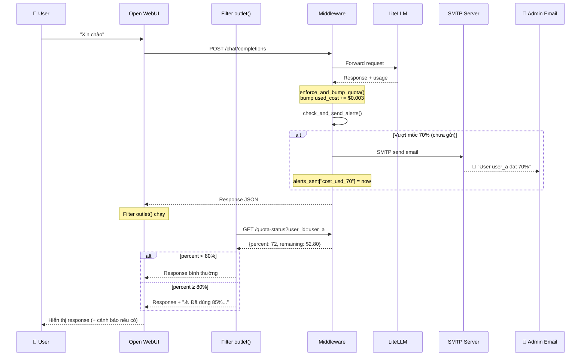

# Chiến lược Cảnh báo Quota: Admin vs User + HOW

> **Tài liệu này mô tả chi tiết chiến lược cảnh báo quota cho hệ thống LLM Gateway.**  
> Bao gồm: phân biệt Admin vs User, cơ chế gửi cảnh báo, và lộ trình triển khai.

---

## Phần I — Admin vs User khác nhau chỗ nào?

### Bảng so sánh tổng thể

| | 👑 Admin | 👤 User |
|--|----------|---------|
| **Quan tâm** | Tổng chi phí API gốc (OpenAI+Gemini) + từng user | Quota cá nhân của mình |
| **Mốc cảnh báo** | 50% ℹ️ → 70% ⚠️ → 90% 🔴 → 100% 🚨 | 80% ⚠️ → 95% 🔴 |
| **Kênh nhận** | 📧 Email + 📊 Dashboard | 💬 Cuối response trong chat |
| **Cooldown** | 1 lần/mốc/kỳ | Mỗi response (khi ≥ 80%) |
| **Nội dung** | Chi tiết: breakdown user/model, trend, action items | Đơn giản: % đã dùng, còn lại bao nhiêu |

### Admin nhận 2 loại email khác nhau:

| Loại | Tracking gì? | Mốc |
|------|-------------|:----:|
| **A. API Budget tổng** | Tổng tiền tất cả user (so vs budget tháng $500) | 50/70/90/100% |
| **B. Per-user quota** | Từng user (user_a dùng 90% quota riêng) | 50/70/90/100% |

### User thấy gì?
- **80%**: `⚠️ Bạn đã dùng 80% quota (còn ~$2.00)`
- **95%**: `🔴 Sắp hết! Còn ~$0.50, liên hệ admin`
- **100%**: `🚫 Hết quota` (HTTP 403, đã có sẵn)

---

## Phần II — GỬI CẢNH BÁO THẾ NÀO? (Chi tiết kỹ thuật)

### Bước 0: Hiểu luồng request hiện tại

```
User gửi tin nhắn
       │
       ▼
┌─────────────────────────────────────────────────────┐
│  Open WebUI  ──(POST /v1/chat/completions)──►  MW   │
│                                                     │
│  MW nhận request → xác thực subkey → forward LiteLLM│
│                                                     │
│  LiteLLM trả response + usage (tokens, cost)        │
│                                                     │
│  MW tính cost → GỌI enforce_and_bump_quota()        │
│  ┌───────────────────────────────────────────┐      │
│  │ ★ ĐÂY LÀ NƠI HOOK ALERT VÀO ★          │      │
│  │                                           │      │
│  │ 1. Bump usage counters                    │      │
│  │ 2. >>> CHECK ALERT THRESHOLDS <<<  (MỚI)  │      │
│  │ 3. >>> GỬI EMAIL NẾU CẦN <<<     (MỚI)  │      │
│  └───────────────────────────────────────────┘      │
│                                                     │
│  MW trả response cho Open WebUI                     │
│                                                     │
│  Open WebUI nhận → Filter outlet() chạy             │
│  ┌───────────────────────────────────────────┐      │
│  │ ★ ĐÂY LÀ NƠI HIỆN ALERT CHO USER ★     │      │
│  │                                           │      │
│  │ 1. Gọi MW API: GET /quota-status          │      │
│  │ 2. Nếu ≥ 80% → append text vào response  │      │
│  └───────────────────────────────────────────┘      │
│                                                     │
│  User thấy response + cảnh báo (nếu có)             │
└─────────────────────────────────────────────────────┘
```

---

### Bước 1: Hook vào đâu trong code? (2 chỗ)

Middleware có **2 luồng** xử lý chat — cần hook cả 2:

#### Hook A — Non-streaming (`_handle_non_streaming`)

> File: `llm-mw/api/chat.py` dòng 559-622

```python
# chat.py dòng 615 — SAU KHI bump quota
enforce_and_bump_quota(user["user_id"], add_tokens=total_tokens, add_cost_usd=cost_usd)

# >>> THÊM ALERT CHECK Ở ĐÂY <<<
# (async, không block response)
asyncio.create_task(
    check_and_send_alerts(user["user_id"], add_cost_usd=cost_usd)
)

# Response trả về bình thường (không bị chậm)
return JSONResponse(status_code=200, content=data)
```

#### Hook B — Streaming (`_finalize_streaming`)

> File: `llm-mw/api/chat.py` dòng 200-295

```python
# chat.py dòng 254-268 — SAU KHI bump quota thủ công
if total_tokens > 0 or cost_usd > 0:
    lock = get_lock()
    with lock:
        users = load_users()
        for u in users:
            if u.get("user_id") == user["user_id"]:
                # ... bump counters ...
                break
        save_users(users)
    
    # >>> THÊM ALERT CHECK Ở ĐÂY <<<
    await check_and_send_alerts(user["user_id"], add_cost_usd=cost_usd)
```

> **Lưu ý**: Streaming response đã gửi xong cho user rồi mới tới `_finalize_streaming()`.
> Nên alert chạy **sau** response — không ảnh hưởng UX.

---

### Bước 2: Hàm `check_and_send_alerts()` làm gì?

```python
# core/alerting.py (FILE MỚI)

import asyncio
import smtplib
import json
from email.mime.text import MIMEText
from email.mime.multipart import MIMEMultipart
from datetime import datetime, timezone

def load_alert_config():
    """Load cấu hình từ data/alert_config.json"""
    with open("data/alert_config.json") as f:
        return json.load(f)

async def check_and_send_alerts(user_id: str, add_cost_usd: float = 0.0):
    """
    Sau mỗi request, check xem có cần gửi alert không.
    Chạy ASYNC (background) — không block response.
    
    Gồm 2 loại check:
    1. Per-user quota (admin email)
    2. Total system budget (admin email) 
    """
    try:
        config = load_alert_config()
        if not config.get("smtp", {}).get("enabled"):
            return
        
        users = load_users()
        
        # ═══════════════════════════════════════════
        # CHECK 1: Per-user quota thresholds
        # ═══════════════════════════════════════════
        user = next((u for u in users if u["user_id"] == user_id), None)
        if user:
            quota = user.get("quota", {})
            limit = float(quota.get("limit_cost_usd", 0) or 0)
            used = float(quota.get("used_cost_usd", 0) or 0)
            
            if limit > 0:
                percent = (used / limit) * 100
                alerts_sent = user.setdefault("alerts_sent", {})
                
                # Check từng mốc admin (50, 70, 90, 100)
                for threshold in config["admin_alerts"]["per_user_quota"]["thresholds"]:
                    milestone_key = f"cost_usd_{threshold}"
                    
                    if percent >= threshold and milestone_key not in alerts_sent:
                        # ★ GỬI EMAIL ADMIN ★
                        await send_admin_email_per_user(
                            config, user_id, 
                            percent=percent, 
                            used=used, limit=limit,
                            threshold=threshold
                        )
                        # Đánh dấu đã gửi (tránh gửi lại)
                        alerts_sent[milestone_key] = datetime.now(timezone.utc).isoformat()
                
                # Lưu lại alerts_sent
                save_users(users)
        
        # ═══════════════════════════════════════════
        # CHECK 2: Total system budget
        # ═══════════════════════════════════════════
        budget_config = config["admin_alerts"]["api_budget"]
        if budget_config["enabled"]:
            monthly_budget = budget_config["monthly_budget_usd"]
            total_spend = sum(
                float(u.get("quota", {}).get("used_cost_usd", 0) or 0) 
                for u in users
            )
            total_percent = (total_spend / monthly_budget * 100) if monthly_budget > 0 else 0
            
            # Check mốc system budget (dùng file riêng để track)
            system_alerts = load_system_alerts()  # data/system_alerts.json
            for threshold in budget_config["thresholds"]:
                key = f"budget_{threshold}"
                if total_percent >= threshold and key not in system_alerts:
                    await send_admin_email_system_budget(
                        config, 
                        total_spend=total_spend, 
                        budget=monthly_budget,
                        percent=total_percent,
                        threshold=threshold,
                        users=users
                    )
                    system_alerts[key] = datetime.now(timezone.utc).isoformat()
            
            save_system_alerts(system_alerts)
    
    except Exception as e:
        logger.error(f"Alert check failed: {e}")
        # KHÔNG raise — alert lỗi không được block user
```

---

### Bước 3: Gửi email thế nào? (SMTP)

```python
# core/alerting.py (tiếp)

async def send_admin_email_per_user(config, user_id, percent, used, limit, threshold):
    """
    Gửi email cho admin: "User X đạt Y% quota"
    Chạy trong thread riêng để không block event loop.
    """
    smtp_cfg = config["smtp"]
    admin_emails = config["admin_alerts"]["emails"]
    
    # Xác định level dựa vào threshold
    level_map = {50: "ℹ️ INFO", 70: "⚠️ WARNING", 90: "🔴 CRITICAL", 100: "🚨 EMERGENCY"}
    level = level_map.get(threshold, "INFO")
    
    subject = f"{level} — User {user_id} đạt {threshold}% quota"
    
    body = f"""
    ━━━━━━━━━━━━━━━━━━━━━━━━━━━━━━━━
    {level} — Per-User Quota Alert
    ━━━━━━━━━━━━━━━━━━━━━━━━━━━━━━━━
    
    User:       {user_id}
    Quota:      ${used:.2f} / ${limit:.2f} ({percent:.0f}%)
    Còn lại:    ${limit - used:.2f}
    Mốc:        {threshold}%
    Thời gian:  {datetime.now().strftime('%Y-%m-%d %H:%M')}
    
    Quick Action:
    • Tăng quota: PUT /v1/_mw/admin/users/{user_id}
    • Reset:      POST /v1/_mw/admin/reset_quota
    ━━━━━━━━━━━━━━━━━━━━━━━━━━━━━━━━
    """
    
    # Gửi trong background thread (không block)
    await asyncio.to_thread(_smtp_send, smtp_cfg, admin_emails, subject, body)


def _smtp_send(smtp_cfg: dict, to_emails: list, subject: str, body: str):
    """
    GỬI EMAIL THỰC SỰ qua SMTP.
    Chạy trong thread riêng (blocking I/O).
    
    ┌──────────┐    SMTP/TLS    ┌──────────────┐
    │ MW Server│ ──────────────► │ Gmail/Outlook│
    │ (Python) │    port 587    │ SMTP Server  │
    └──────────┘                └──────┬───────┘
                                       │
                                       ▼
                               ┌──────────────┐
                               │ Admin Inbox  │
                               │ admin@co.com │
                               └──────────────┘
    """
    import os
    
    msg = MIMEMultipart()
    msg["From"] = smtp_cfg["from_email"]
    msg["To"] = ", ".join(to_emails)
    msg["Subject"] = subject
    msg.attach(MIMEText(body, "plain", "utf-8"))
    
    password = os.environ.get(smtp_cfg["password_env"], "")
    
    with smtplib.SMTP(smtp_cfg["host"], smtp_cfg["port"]) as server:
        if smtp_cfg.get("use_tls"):
            server.starttls()          # Bật mã hóa TLS
        server.login(smtp_cfg["username"], password)  # Đăng nhập SMTP
        server.send_message(msg)       # GỬI EMAIL
    
    logger.info(f"Alert email sent to {to_emails}: {subject}")
```

**Giải thích đơn giản:**

```
1. MW tính xong cost → gọi check_and_send_alerts()
2. Hàm này đọc users.json → tính % quota
3. Nếu vượt mốc (VD: 70%) VÀ chưa gửi lần nào cho mốc này:
   → Tạo email text
   → Kết nối SMTP server (Gmail/Outlook)
   → Đăng nhập bằng username + SMTP_PASSWORD (env var)
   → Gửi email đến admin_emails
   → Đánh dấu "đã gửi mốc 70%" vào alerts_sent
4. Lần request sau, vẫn ở 72% → KHÔNG gửi lại (đã đánh dấu)
5. Request tiếp, lên 91% → vượt mốc 90% mới → GỬI THÊM email mốc 90%
```

---

### Bước 4: User thấy cảnh báo thế nào? (Filter trong OW)

```
User chat ─► OW ─► MW ─► LiteLLM ─► Provider (OpenAI/Gemini)
                                          │
                                     Response
                                          │
User thấy ◄── OW ◄── Filter outlet() ◄── MW trả response
                         │
                    ★ Filter chạy ở ĐÂY ★
                    Gọi MW API kiểm tra quota %
                    Nếu ≥ 80% → thêm text cảnh báo
```

**Filter Function (cài trên Open WebUI Admin → Functions):**

```python
"""
title: Quota Alert Filter
type: filter
"""

import requests

class Filter:
    class Valves(BaseModel):
        middleware_url: str = "http://middleware:5000"
        # Không cần admin key — endpoint /quota-status là public
    
    def __init__(self):
        self.valves = self.Valves()
    
    async def outlet(self, body: dict, __user__: dict = None) -> dict:
        """
        SAU KHI nhận response từ LLM:
        1. Gọi MW hỏi: "user này dùng bao nhiêu % quota?"
        2. Nếu ≥ 80% → nối thêm dòng cảnh báo vào cuối response
        """
        if not __user__:
            return body
        
        try:
            # Gọi MW API (nhẹ, ~20ms)
            resp = requests.get(
                f"{self.valves.middleware_url}/v1/_mw/quota-status",
                params={"user_id": __user__["id"]},
                timeout=2
            )
            if resp.status_code != 200:
                return body
            
            data = resp.json()
            if data.get("unlimited"):
                return body  # Không giới hạn → bỏ qua
            
            percent = data.get("percent_used", 0)
            remaining = data.get("remaining_usd", 0)
            
            # Chỉ hiện khi ≥ 80%
            if percent >= 95:
                alert = (
                    f"\n\n---\n🔴 **Cảnh báo**: Bạn đã dùng "
                    f"**{percent:.0f}%** quota tháng này "
                    f"(còn ~${remaining:.2f}). "
                    f"Liên hệ admin nếu cần tăng."
                )
                body["messages"][-1]["content"] += alert
            elif percent >= 80:
                alert = (
                    f"\n\n---\n⚠️ Bạn đã dùng "
                    f"**{percent:.0f}%** quota tháng này "
                    f"(còn ~${remaining:.2f})."
                )
                body["messages"][-1]["content"] += alert
        except Exception:
            pass  # Lỗi → không block user
        
        return body
```

**Filter hoạt động thế nào?**

```
1. User gửi "Xin chào"
2. OW forward → MW → LiteLLM → GPT trả "Xin chào! Tôi có thể giúp gì?"
3. OW nhận response → chạy outlet()
4. outlet() gọi GET http://middleware:5000/v1/_mw/quota-status?user_id=user_a
5. MW trả: {"percent_used": 85, "remaining_usd": 1.50}
6. 85% ≥ 80% → outlet() nối thêm text:
   
   "Xin chào! Tôi có thể giúp gì?
   
   ---
   ⚠️ Bạn đã dùng **85%** quota tháng này (còn ~$1.50)."

7. User thấy response có dòng cảnh báo ở cuối
```

---

### Bước 5: API `/quota-status` trên MW

```python
# api/quota_status.py (FILE MỚI trong MW)

from fastapi import APIRouter, Query
from core.auth import load_users
from core.quota import maybe_reset_quota

router = APIRouter()

@router.get("/v1/_mw/quota-status")
async def get_quota_status(user_id: str = Query(...)):
    """
    Lightweight endpoint — Filter trên OW gọi mỗi response.
    Không cần admin key (chỉ trả % chung, không trả chi tiết).
    """
    users = load_users()
    user = next((u for u in users if u["user_id"] == user_id), None)
    
    if not user:
        return {"found": False}
    
    maybe_reset_quota(user)  # Đảm bảo đúng kỳ
    quota = user.get("quota", {})
    limit = float(quota.get("limit_cost_usd", 0) or 0)
    used = float(quota.get("used_cost_usd", 0) or 0)
    
    return {
        "found": True,
        "user_id": user_id,
        "percent_used": round(used / limit * 100, 1) if limit > 0 else 0,
        "remaining_usd": round(max(0, limit - used), 2) if limit > 0 else None,
        "unlimited": limit <= 0
    }
```

---

### Bước 6: Tránh spam — `alerts_sent` tracking

```json
// Trong users.json — thêm field cho mỗi user:
{
  "user_id": "user_a",
  "quota": { "limit_cost_usd": 10, "used_cost_usd": 7.5 },
  "alerts_sent": {
    "cost_usd_50": "2026-02-20T10:00:00Z",
    "cost_usd_70": "2026-02-23T14:30:00Z"
    // 90 chưa có → sẽ gửi khi vượt 90%
  }
}
```

**Reset khi nào?** Thêm 1 dòng vào `maybe_reset_quota()`:

```diff
 def maybe_reset_quota(user):
     quota = user.setdefault("quota", {})
     # ...
     if int(quota.get("period_start", 0)) < current_anchor:
         quota["period_start"] = current_anchor
         quota["used_tokens"] = 0
         quota["used_cost_usd"] = 0.0
         quota["used_image_requests"] = 0
+        # Reset alert tracking cho kỳ mới
+        user["alerts_sent"] = {}
```

---

## Phần III — Cấu hình `alert_config.json`

```json
{
  "smtp": {
    "enabled": true,
    "host": "smtp.gmail.com",
    "port": 587,
    "username": "admin@company.com",
    "password_env": "SMTP_PASSWORD",
    "from_email": "llm-gateway@company.com",
    "use_tls": true
  },
  "admin_alerts": {
    "emails": ["admin@company.com"],
    "api_budget": {
      "enabled": true,
      "monthly_budget_usd": 500.00,
      "thresholds": [50, 70, 90, 100]
    },
    "per_user_quota": {
      "enabled": true,
      "thresholds": [50, 70, 90, 100]
    }
  },
  "user_alerts": {
    "enabled": true,
    "thresholds": [80, 95]
  }
}
```

---

## Phần IV — Tổng kết luồng



---

## Phần V — Lộ trình triển khai

| Phase | Thời gian | Nội dung | Files mới/sửa |
|:-----:|:---------:|----------|----------------|
| **1** | 3-4 ngày | Core email alerts cho admin | `data/alert_config.json`, `core/alerting.py`, sửa `core/quota.py`, sửa `api/chat.py` |
| **2** | 2 ngày | User in-chat alerts | `api/quota_status.py`, Filter Function trên OW |
| **3** | 2-3 ngày | Dashboard + advanced | Alert history, spike detection, daily digest |

### Phase 1 Chi tiết:
- [ ] Tạo `data/alert_config.json` (cấu hình SMTP + thresholds)
- [ ] Tạo `core/alerting.py` (check threshold + send email + cooldown)
- [ ] Hook vào `core/quota.py` → `enforce_and_bump_quota()` 
- [ ] Hook vào `api/chat.py` → `_finalize_streaming()`
- [ ] Reset `alerts_sent` trong `maybe_reset_quota()`
- [ ] Admin API: `GET/PUT /v1/_mw/admin/alerts/config`, `POST /test-email`
- [ ] Test end-to-end: bump → vượt 50% → email

### Phase 2 Chi tiết:
- [ ] Tạo `api/quota_status.py` (GET /v1/_mw/quota-status)
- [ ] Viết Filter Function Python cho Open WebUI
- [ ] Cài filter trên OW Admin → Functions
- [ ] Test: user chat → vượt 80% → thấy cảnh báo trong response

### Phase 3 Chi tiết:
- [ ] Dashboard tab "Alert Settings" 
- [ ] Alert history log + viewer
- [ ] Email HTML template (thay vì plain text)
- [ ] Spike detection logic
- [ ] Daily digest email (cron job)
