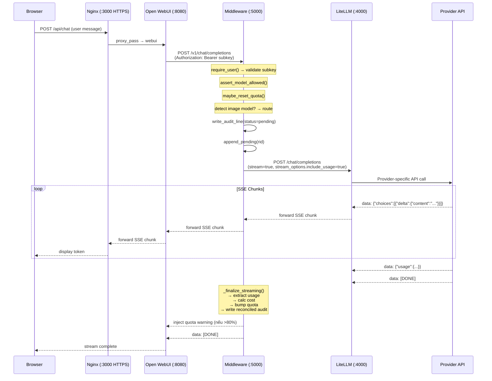
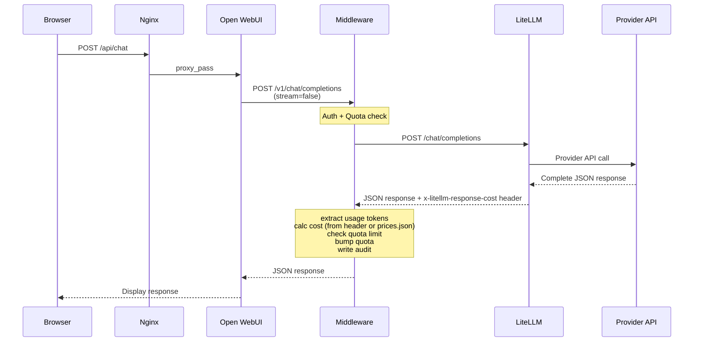
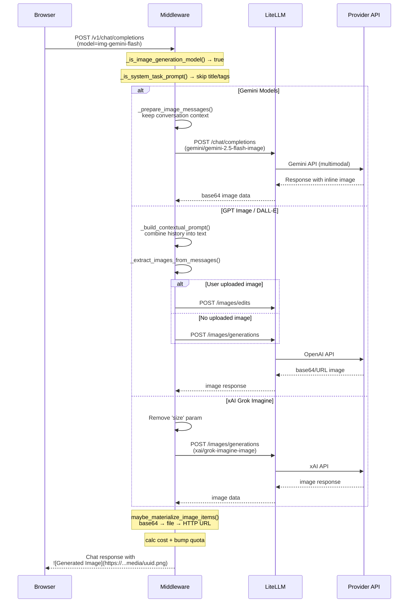
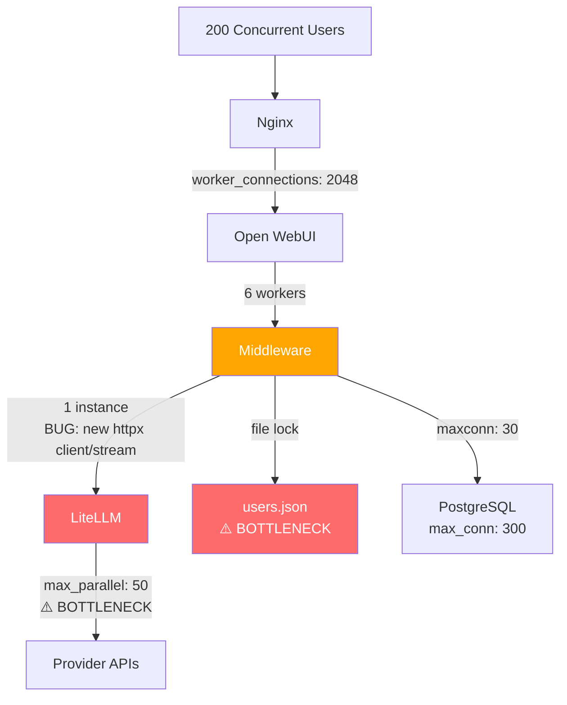
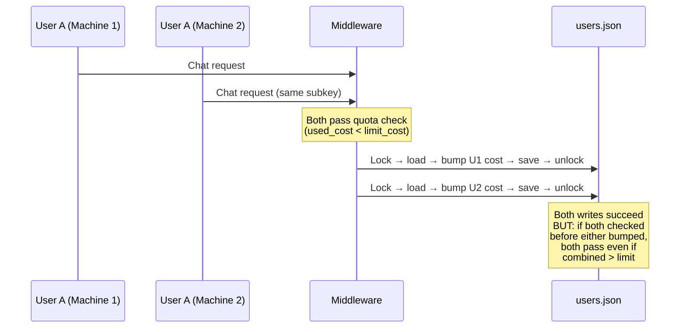
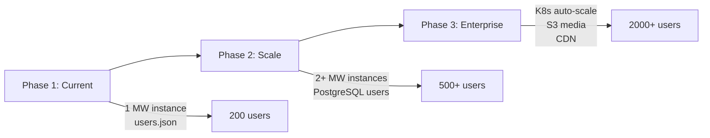

# Chat Flow Analysis & Scalability Report

> **Phiên bản**: 1.0 — 2026-04-04
> **Tác giả**: AI Assistant
> **Change**: `chat-flow-analysis-and-scalability`

---

## 1. Sequence Diagrams

### 1.1 Streaming Chat Flow



### 1.2 Non-Streaming Chat Flow



### 1.3 Image Generation Flow



---

## 2. Provider Parameter Compatibility Matrix

### 2.1 Chat Models

| Parameter | OpenAI GPT-5.x | Gemini 2.5/3.x | xAI Grok 4.x | Anthropic Claude 4.x |
|-----------|:-:|:-:|:-:|:-:|
| `max_tokens` | ⚠️ Convert to `max_completion_tokens` | ✅ Supported | ✅ Supported | ✅ Supported |
| `max_completion_tokens` | ✅ Required for GPT-5+ | ❌ Dropped | ❌ Dropped | ❌ Dropped |
| `stream` | ✅ | ✅ | ✅ | ✅ |
| `stream_options.include_usage` | ✅ | ✅ | ⚠️ Partial | ✅ |
| `temperature` | ✅ 0-2 | ✅ 0-2 | ✅ 0-2 | ✅ 0-1 |
| `top_p` | ✅ | ✅ | ✅ | ✅ |
| `frequency_penalty` | ✅ | ❌ Dropped | ✅ | ❌ Dropped |
| `presence_penalty` | ✅ | ❌ Dropped | ✅ | ❌ Dropped |
| `tools` / `tool_choice` | ✅ | ✅ | ✅ | ✅ |
| Image in messages (base64) | ✅ | ✅ | ✅ | ✅ |
| Context window | 1M (GPT-5.4) | 1M | 2M | 200K |

> ⚠️ = Cần handling đặc biệt | ❌ Dropped = LiteLLM `drop_params: true` sẽ tự loại bỏ

### 2.2 Image Models

| Parameter | GPT Image 1/1.5 | DALL-E 3 | Gemini Image | Grok Imagine |
|-----------|:-:|:-:|:-:|:-:|
| `size` | ✅ | ✅ | N/A (chat API) | ❌ Không hỗ trợ |
| `aspect_ratio` | ❌ | ❌ | N/A | ✅ Thay cho size |
| `n` (number) | ✅ | ✅ 1 only | N/A | ✅ |
| `response_format` | ✅ b64_json/url | ✅ | N/A | ✅ |
| API Endpoint | /images/generations | /images/generations | /chat/completions | /images/generations |
| Image Edit | ✅ /images/edits | ❌ | ✅ (via chat) | ❌ |
| Avg Image Size | ~500 KB | ~500 KB | ~200 KB | ~300 KB |

---

## 3. Error Paths & Recovery

### 3.1 Error Flow

| Error Type | HTTP Code | Source | Retry | User-facing Message |
|-----------|:-:|--------|:-:|-----|
| Invalid subkey | 401 | Middleware | ❌ | "Unauthorized" |
| Model not allowed | 403 | Middleware | ❌ | "Model not in allowed_models" |
| Quota exceeded (tokens) | 403 | Middleware | ❌ | "Bạn đã hết quota token tháng này" |
| Quota exceeded (cost) | 403 | Middleware | ❌ | "Bạn đã hết quota tháng này" |
| Provider rate limit | 429 | LiteLLM | ✅ 2 retries | "Rate limited" |
| Provider server error | 500/502/503 | Provider | ✅ 2 retries | "Service unavailable" |
| Timeout (>120s) | 504 | LiteLLM | ❌ | "Request timed out" |
| Image gen fail | 400+ | Provider | ❌ | "Image generation unavailable" |
| Stream disconnect | N/A | Network | ❌ | Stream ends, partial output |

### 3.2 LiteLLM Retry Configuration
```yaml
litellm_settings:
  request_timeout: 120
  num_retries: 2        # Retry on 429, 500, 502, 503
  drop_params: true     # Silently drop unsupported params
```

---

## 4. Scalability Analysis: 200 Concurrent Users

### 4.1 Bottleneck Analysis



| Layer | Cấu hình hiện tại | Max Capacity | Bottleneck? |
|-------|------------|:---:|:---:|
| Nginx | worker_connections: 2048 | ~2000 | ❌ OK |
| Open WebUI | 6 workers, Redis WS | ~600 req/s | ❌ OK |
| **Middleware** | **1 instance, 1 httpx/stream** | **~100-200** | **⚠️** |
| **LiteLLM** | **max_parallel_requests: 50** | **50** | **🔴 Critical** |
| PostgreSQL | max_connections: 300 | >300 | ❌ OK |
| **users.json** | **File lock (serialize)** | **~50-100 ops/s** | **🔴 Critical** |

### 4.2 Bandwidth Requirements

| Scenario | Per User | 200 Users | Server Capacity |
|----------|:--------:|:---------:|:---------------:|
| Streaming chat (text) | 5-50 KB/s | 1-10 MB/s | ✅ |
| Image response (serve) | ~300 KB one-time | ~60 MB burst | ✅ |
| Image generation (API) | ~500 KB download | N/A (serial per user) | ✅ |
| WebSocket keepalive | ~1 KB/min | ~200 KB/min | ✅ |
| **Peak total** | | **~10-15 MB/s** | ✅ (100 Mbps+) |

> Bandwidth is **NOT** a bottleneck. Network capacity (~100 Mbps) dư sức cho 200 users.

### 4.3 Latency Budget (P95 Target)

| Component | Latency | Cumulative |
|-----------|:-------:|:----------:|
| Nginx SSL termination | 1-3 ms | 3 ms |
| Open WebUI routing | 5-10 ms | 13 ms |
| Middleware auth + quota | 5-20 ms | 33 ms |
| LiteLLM routing + retry | 10-30 ms | 63 ms |
| **Provider TTFB** | **500 ms - 5 s** | **5.06 s** |
| Stream first token | | **~5 s P95** |

> Provider API là yếu tố chi phối latency (>95%). Optimize internal routing chỉ cải thiện ~50-100ms.

### 4.4 Docker Resource Limits Assessment

| Service | Current | 200 Users | Recommendation |
|---------|---------|:---------:|:----|
| Middleware | 2G / 4CPU | Đủ | Tăng lên 4G nếu thêm caching |
| LiteLLM | 4G / 4CPU, 4 workers | ⚠️ Tight | Tăng `max_parallel_requests: 100`, 6 workers |
| Open WebUI | 10G / 6CPU, 6 workers | Đủ | OK |
| PostgreSQL | 8G / 2CPU | Đủ | OK |
| Nginx | 512M / 1CPU | Đủ | OK |
| Redis | 256M / 0.5CPU | Đủ | OK |

---

## 5. File I/O Bottleneck: users.json

### 5.1 Vấn đề
- Mỗi request cần: `load_users()` → read file → JSON parse → modify → JSON serialize → write file
- File lock (`threading.Lock`) serialize tất cả writes
- Estimated: **1-5ms per lock acquire** → với 200 concurrent: **200-1000ms contention**

### 5.2 Impact
```
200 concurrent quota updates:
- Sequential lock: 200 × 2ms = ~400ms total wait
- Last user waits: ~400ms for quota check
- Throughput: ~500 ops/sec (vs target ~200 ops/sec) → Barely sufficient
- Risk: File corruption if crash during write
```

### 5.3 Recommendation
- **Short-term**: Acceptable cho 200 users, file lock đảm bảo consistency
- **Long-term**: Migrate sang PostgreSQL table (`mw_users`) cho:
  - Row-level locks (concurrent updates)
  - Crash recovery (WAL)
  - JOIN với audit data

---

## 6. Concurrent Sessions: Same Account Analysis

### 6.1 Quota Race Condition



**Worst-case overshoot**: 1 request cost (max ~$0.05 for GPT-5).
File lock serializes writes but NOT the check+bump atomically for streaming.

### 6.2 Session Token Behavior
- Mỗi login tạo JWT token riêng → sessions **độc lập**
- Chat history **shared** (cùng Open WebUI account)
- WebSocket channels **isolated** per session (Socket.IO rooms)
- Streaming responses **independent** — mỗi stream có request_id riêng

### 6.3 Message Interleaving Risk
- Nếu 2 users chat cùng conversation ID đồng thời:
  - Messages lưu lần lượt vào DB (Open WebUI handles this)
  - **Không có lock** ở conversation level → messages có thể xen kẽ
  - UI refresh sẽ thấy messages từ cả 2 sessions
- **Risk level**: LOW — hiếm khi 2 người chat cùng 1 conversation

### 6.4 Recommendations
| Option | Pros | Cons |
|--------|------|------|
| Limit concurrent sessions per account | Prevent resource abuse | Poor UX, need session management |
| Atomic quota check+bump | Eliminate overshoot | Requires DB transaction |
| Per-conversation lock | Prevent interleaving | Complex, low value |
| **Recommend: Do nothing (phase 1)** | Simple, overshoot minimal | Accept ~$0.05 worst case |

---

## 7. Stress Test Plan (Locust)

### 7.1 Test Scenarios
```python
# locustfile.py outline
class ChatUser(HttpUser):
    wait_time = between(1, 5)
    
    @task(8)
    def streaming_chat(self):
        # POST /v1/chat/completions stream=true
        # Measure time-to-first-token (TTFT)
        pass
    
    @task(2) 
    def image_generation(self):
        # POST /v1/chat/completions model=img-gemini-flash
        # Measure full image generation time
        pass

# Target: 200 users, 5 min ramp, 10 min sustained
# Metrics: P95 TTFT, Error rate, Throughput
```

### 7.2 Expected Results
| Metric | Target | Risk |
|--------|--------|------|
| P95 TTFT | < 6s | LiteLLM queue at 50 parallel |
| Error rate | < 1% | Quota/timeout errors |
| Throughput | > 30 req/s | File lock contention |

---

## 8. Horizontal Scaling Roadmap (Phase 2)



| Step | Change | Impact |
|------|--------|--------|
| 1 | Migrate users.json → PostgreSQL | Remove file lock bottleneck |
| 2 | LiteLLM `max_parallel_requests: 100+` | Double concurrent capacity |
| 3 | Nginx upstream: 2 middleware instances | Double MW throughput |
| 4 | S3/MinIO for media storage | Persistent, scalable media |
| 5 | CDN (CloudFront/Cloudflare) | Edge caching for media |
