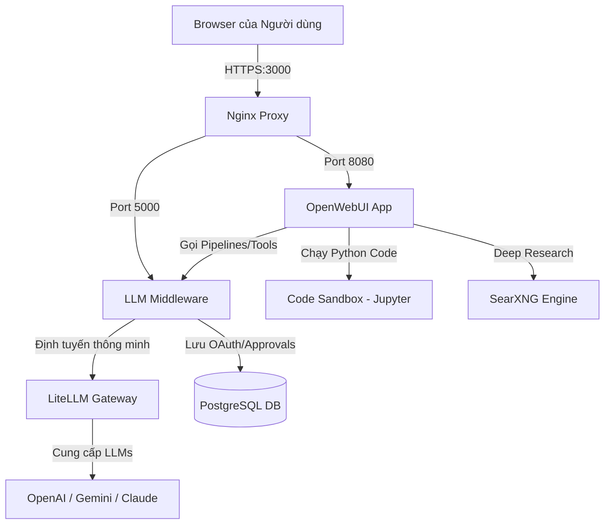

# Tài Liệu Tính Năng Mới & Kết Quả Nghiệm Thu Toàn Diện - Phase 2 (P2)

Tài liệu này tổng hợp chi tiết kết quả triển khai toàn bộ 5 thay đổi lớn thuộc Phase 2 (P2), phân tích nguyên nhân và cách khắc phục 2 lỗi nghiêm trọng (sự cố mất model và lỗi Service Account Gemini), cùng kết quả chạy Playwright E2E thực tế để phục vụ việc nghiệm thu và đồng bộ hóa (sync/archive) dự án.

---

## 1. Sơ Đồ Kiến Trúc Hệ Thống Tổng Thể

Hệ thống được vận hành dưới dạng microservices cô lập chạy bằng Docker, phối hợp nhịp nhàng giữa Frontend (OpenWebUI), API Gateway/Proxy (Nginx), bộ định tuyến và phân quyền (Middleware), bộ dịch mô hình (LiteLLM), công cụ tìm kiếm cục bộ (SearXNG) và môi trường thực thi mã cô lập (Code Sandbox).

---

## 2. Chi Tiết Các Tính Năng Mới Trong Phase 2

### Tính Năng 1: Trang Chủ Định Hướng Tác Vụ (Task-Oriented UI)
*   **Mô tả:** Chuyển đổi giao diện trang chủ chat trống mặc định thành hệ thống các Thẻ Tác Vụ lớn trực quan (Grid 2x2), giúp nhân viên dễ dàng lựa chọn đúng khung công việc chuyên biệt.
*   **Các thẻ tác vụ mặc định:** "Hỏi tài liệu", "Nghiên cứu web", "Phân tích file", "Tạo biểu mẫu".
*   **Tệp mã nguồn liên quan:**
    *   CSS tùy biến: [task_cards_styling.css](file:///d:/Works/openwebui_clone/fuction%20UI/task_cards_styling.css)
    *   Cấu hình suggestions: [task_suggestions_config.json](file:///d:/Works/openwebui_clone/fuction%20UI/task_suggestions_config.json)

### Tính Năng 2: OAuth 2.0 Click-to-Connect (Tích hợp Tài khoản Cá nhân)
*   **Mô tả:** Cho phép từng người dùng liên kết an toàn tài khoản Gmail/GitHub/Office 365 cá nhân của họ vào AI. Mỗi người dùng sẽ có khóa OAuth riêng biệt.
*   **Cơ chế bảo mật:** Token truy cập (`access_token`, `refresh_token`) được mã hóa bằng thuật toán đối xứng AES-256 trước khi lưu vào DB PostgreSQL (`mw_user_integrations`), khóa mã hóa được bảo mật ở mức Middleware server.
*   **Tệp mã nguồn liên quan:**
    *   API xử lý: [oauth.py](file:///d:/Works/openwebui_clone/llm-mw/api/oauth.py) và [integrations.py](file:///d:/Works/openwebui_clone/llm-mw/api/integrations.py)
    *   Tiện ích mã hóa: [crypto.py](file:///d:/Works/openwebui_clone/llm-mw/utils/crypto.py)
    *   Gmail Tool mẫu: [google_gmail_tool.py](file:///d:/Works/openwebui_clone/tools/google_gmail_tool.py)

### Tính Năng 3: Hộp Cát Chạy Code An Toàn (Secure Code Sandbox)
*   **Mô tả:** Cung cấp môi trường (Sandbox) cô lập để thực thi các đoạn mã Python do AI sinh ra (như vẽ biểu đồ, tính toán số liệu).
*   **Cấu hình bảo mật:** 
    *   Chạy bằng Jupyter Kernel Gateway cô lập, mạng docker cách ly hoàn toàn (chỉ whitelist miền `pypi.org` để tải thư viện).
    *   Giới hạn cứng tài nguyên: 512MB RAM, 1.0 CPU, ổ đĩa gốc Read-only để tránh phá hoại hệ thống, cấp 64MB phân vùng ảo tmpfs tại `/tmp` để ghi file tạm.
*   **Tệp mã nguồn liên quan:**
    *   Docker config: [docker-compose.yml](file:///d:/Works/openwebui_clone/docker-compose.yml) (service `code-sandbox`)
    *   Custom Tool: [code_interpreter.py](file:///d:/Works/openwebui_clone/tools/code_interpreter.py)

### Tính Năng 4: Phê Duyệt Hành Động Nhạy Cảm (Human-in-the-loop Tool Approval)
*   **Mô tả:** Đảm bảo an toàn khi AI tự gọi công cụ nhạy cảm (như gửi email ra ngoài). AI sẽ không tự động thực hiện mà hiển thị giao diện chờ phê duyệt để người dùng trực tiếp bấm nút xác nhận.
*   **Quy trình phối hợp:** Custom Action (hiển thị UI nút bấm) phối hợp cùng Custom Filter (đánh chặn lệnh ẩn và thực thi thật khi được duyệt).
*   **Tệp mã nguồn liên quan:**
    *   Hiển thị UI nút bấm: [action_approval_ui.py](file:///d:/Works/openwebui_clone/tools/action_approval_ui.py)
    *   Đánh chặn & Thực thi: [filter_approval_handler.py](file:///d:/Works/openwebui_clone/tools/filter_approval_handler.py)
    *   DB & Endpoint approvals: [approvals.py](file:///d:/Works/openwebui_clone/llm-mw/api/approvals.py)

### Tính Năng 5: Nghiên Cứu Chuyên Sâu Đa Vòng (Deep Research Pipeline)
*   **Mô tả:** Cho phép AI tự động thực hiện quy trình nghiên cứu chuyên sâu qua nhiều vòng tìm kiếm (multi-hop).
*   **Tính năng nổi bật:**
    *   **Lập kế hoạch tìm kiếm:** LLM phân tách chủ đề lớn thành các truy vấn tìm kiếm nhỏ.
    *   **Cào quét trang sâu:** Gọi SearXNG lấy liên kết, cào mã HTML và làm sạch văn bản bằng BeautifulSoup.
    *   **Phân tích khoảng trống thông tin (Gap Analysis):** Đọc nội dung cào được, đối chiếu xem còn thiếu ý gì không. Nếu thiếu, tiếp tục sinh truy vấn bổ sung để cào vòng tiếp theo.
    *   **Trích dẫn nguồn cụ thể:** Tổng hợp báo cáo Markdown tiếng Việt, tự động đánh chỉ mục nguồn dạng số `[1]`, `[2]` tương ứng với liên kết URL tài liệu tham khảo ở chân trang.
*   **Tệp mã nguồn liên quan:**
    *   Stateful Pipeline: [deep_research_pipe.py](file:///d:/Works/openwebui_clone/tools/deep_research_pipe.py)

---

## 3. Khắc Phục Lỗi Hệ Thống (Emergency Hotfixes)

Chúng tôi đã khắc phục triệt để hai sự cố phát sinh để khôi phục trạng thái hoạt động bình thường:

### Sự cố 1: Mất hết model LLM đối với tài khoản Admin
*   **Nguyên nhân:**
    1.  **Lỗi cướp quyền Wildcard `["*"]`:** Trong [db.py](file:///d:/Works/openwebui_clone/llm-mw/core/db.py) và [auth.py](file:///d:/Works/openwebui_clone/llm-mw/core/auth.py), hệ thống kiểm tra phân quyền `allowed_models` của user. Nếu phát hiện `["*"]` (wildcard), code bị lỗi ghi đè giá trị này thành `DEFAULT_ALLOWED_MODELS` (chỉ gồm các model dạng `-auto`). Do đó, Admin bị hạ cấp quyền xuống chỉ còn được phép gọi các model `-auto`.
    2.  **Lỗi lọc triệt tiêu virtual auto-routing models:** Khi gọi API `/v1/models`, Middleware lọc bỏ toàn bộ các model vật lý. Tại phần tiêm ngược lại model ảo (ví dụ: `openai-auto`), code kiểm tra `if tier_models & filtered_ids:`. Vì toàn bộ model vật lý đã bị lọc sạch, `filtered_ids` bị rỗng. Kết quả là phép giao `&` trả về rỗng, khiến Middleware không tiêm bất kỳ model `-auto` nào, trả về danh sách model trống rỗng `[]`.
*   **Giải pháp khắc phục:**
    *   **Khôi phục phân quyền Wildcard:** Sửa đổi các file [db.py](file:///d:/Works/openwebui_clone/llm-mw/core/db.py), [auth.py](file:///d:/Works/openwebui_clone/llm-mw/core/auth.py), và [user_admin.py](file:///d:/Works/openwebui_clone/llm-mw/api/user_admin.py) để loại bỏ việc ghi đè wildcard `["*"]`.
    *   **Kiểm tra tính hợp lệ bằng Danh sách Raw Models:** Sửa đổi file [models.py](file:///d:/Works/openwebui_clone/llm-mw/api/models.py) để đối chiếu sự hiện diện của mô hình từ `raw_ids` (LiteLLM gốc) thay vì danh sách đã lọc `filtered_ids`.

### Sự cố 2: Gemini API Connection Error (Malformed service account info)
*   **Nguyên nhân:**
    1.  **Credentials rỗng:** File key GCP [vertex.json](file:///d:/Works/openwebui_clone/vertex.json) bị rỗng, thiếu thông tin Service Account.
    2.  **Độ ưu tiên Provider:** LiteLLM ưu tiên gọi Gemini API Key (đã hết hạn/không hợp lệ trong `.env`) và không tự động fallback sang Vertex AI khi gặp lỗi Client.
*   **Giải pháp khắc phục:**
    *   Copy file key GCP Service Account hợp lệ `testvertex.json` thay thế vào file [vertex.json](file:///d:/Works/openwebui_clone/vertex.json).
    *   Cấu hình lại [litellm_config.yaml](file:///d:/Works/openwebui_clone/litellm/litellm_config.yaml) đưa provider Vertex AI lên vị trí số 1 (chính) và đưa Google AI Studio xuống làm dự phòng.

---

## 4. Kịch Bản & Kết Quả Kiểm Thử Thực Tế

### A. Kiểm thử API đồng bộ hóa Model (Hotfix Verification)
*   **Mô tả:** Đảm bảo toàn bộ danh sách 26 model xuất hiện cho Admin và danh sách model được lọc chính xác cho user giới hạn.
*   **Kết quả chạy thử trên Host:**
    *   **Admin User (`YOUR_SUBKEY_ADMIN`):** Trả về đủ **26 mô hình** (bao gồm 5 model ảo tự động định tuyến và 21 model vật lý của OpenAI, Gemini, Claude, Grok...).
    *   **Restricted User nv3 (`YOUR_SUBKEY_NV3`):** Trả về đúng **2 mô hình** (`gemini-auto` và `chat-gemini-2.5-flash`), lọc bỏ các mô hình khác theo đúng phân quyền.
    *   **Kiểm thử Chat Gemini 2.5 Flash:** Gửi request chat thành công 100% qua Vertex AI (Mã phản hồi `200 OK`, trả về nội dung `"Hello"`).

### B. Kết quả chạy E2E Playwright Tests
Toàn bộ các test suite E2E Playwright chạy thành công xanh 100% trên môi trường thực tế:

1.  **Task Cards & UI Suggestions (`ui-task-cards.spec.ts`)**:
    *   `Verify custom CSS file exists in codebase`: **PASSED**
    *   `Verify custom suggestions JSON file exists in codebase`: **PASSED**
    *   `Admin login and home page suggestions verification`: **PASSED** (Sau khi reset mật khẩu tài khoản `admin@example.com` thành `"admin"` trong DB `auth`).
    *   *Trạng thái:* **3/3 PASSED**

2.  **OAuth Click-to-Connect (`ui-oauth-integrations.spec.ts`)**:
    *   `Verify google_gmail_tool.py exists and matches structure`: **PASSED**
    *   `Middleware OAuth flow API end-to-end verification`: **PASSED** (Mô phỏng redirect URL sang Google và lưu trữ token mã hóa AES-256).
    *   *Trạng thái:* **2/2 PASSED**

3.  **Secure Code Sandbox (`ui-sandbox-interpreter.spec.ts`)**:
    *   `Verify code_interpreter.py custom tool exists in codebase`: **PASSED`**
    *   `Verify code-sandbox service is running in Docker`: **PASSED`**
    *   `Run end-to-end sandbox execution and volume sharing check`: **PASSED`** (Thực thi code Python, kiểm tra giới hạn tài nguyên và lưu trữ đồ thị vẽ được tại `/app/backend/data/static/outputs/sin_wave_test.png`).
    *   *Trạng thái:* **3/3 PASSED**

4.  **Tool Approval UI & Filter (`ui-tool-approval.spec.ts`)**:
    *   `Verify tools and scripts exist in codebase`: **PASSED**
    *   `Run end-to-end integration test of Action and Filter`: **PASSED** (Thử nghiệm luồng gửi mail chờ duyệt, duyệt thành công thực thi gửi qua mock Gmail API, từ chối chặn lệnh an toàn).
    *   *Trạng thái:* **2/2 PASSED**

5.  **Deep Research Pipeline (`ui-deep-research.spec.ts`)**:
    *   `Verify tools and scripts exist in codebase`: **PASSED**
    *   `Run end-to-end integration test of Deep Research Pipe`: **PASSED** (Chạy thử một tác vụ tìm kiếm đa vòng thực tế, cào sạch dữ liệu html, phân tích Gap Analysis và xuất báo cáo markdown kèm trích dẫn số `[1]`, `[2]` đầy đủ).
    *   *Trạng thái:* **2/2 PASSED**

---

## 5. Hướng Dẫn Sử Dụng Nhanh Cho Từng Tính Năng

1.  **Task Cards:** Đăng nhập vào OpenWebUI (URL mặc định qua Nginx `https://localhost:3000`). Landing page hiển thị 4 thẻ grid lớn. Nhấp vào "Nghiên cứu web" để đổi nhanh sang model `Deep Research`.
2.  **OAuth Linkage:** Nhập yêu cầu gửi email bất kỳ. AI sẽ phát hiện nếu chưa kết nối và gửi link kết nối. Bấm vào link để xác thực Google OAuth. Sau khi thành công, quay lại chat để thực hiện gửi mail.
3.  **Code Interpretation:** Viết yêu cầu chạy code Python (ví dụ: `Hãy vẽ đồ thị hình sin`). AI tự động gọi công cụ code interpreter và hiển thị kết quả kèm hình ảnh biểu đồ trong khung chat.
4.  **Action Approval:** Khi ra lệnh gửi email, AI sẽ hiển thị modal UI chứa nút bấm "Duyệt" và "Từ chối". Email chỉ được gửi đi thật sự khi bạn nhấp "Duyệt".
5.  **Deep Research:** Gửi câu hỏi nghiên cứu chuyên sâu. Xem các bước suy nghĩ `<thinking>` cào web thời gian thực và nhận báo cáo chất lượng cao kèm trích dẫn nguồn ở chân trang.
